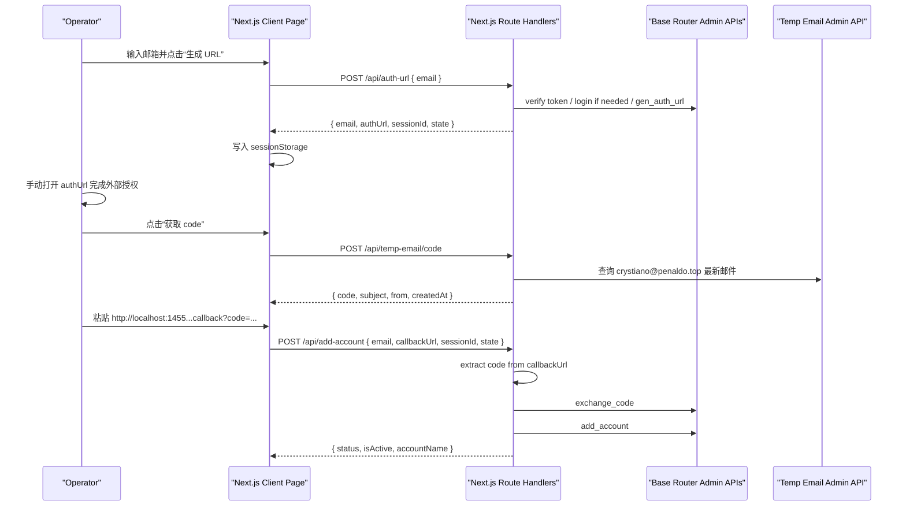

# feat: Build semiauto-add Next.js console

## Problem Frame
[`semiauto-add`](/D:/Code/Projects/semiauto-add) 现在只有需求稿，没有应用骨架。目标是把 [`auto-add`](/D:/Code/Projects/auto-add) 里已经验证过的服务端 HTTP 能力迁成一个单体 Next.js 内部工具，让操作员在一个页面里完成：

1. 输入邮箱
2. 生成授权 URL
3. 手动打开 URL 完成外部授权
4. 拉固定邮箱验证码
5. 粘贴 `http://localhost:1455...` 回调 URL
6. 完成 `exchange_code -> add_account`

计划必须保留 requirements 中已经钉死的边界，不再发明产品行为，尤其是：

- `GEN_AUTH_URL` 不吃邮箱，邮箱只是半自动流程的业务上下文
- 回调 `code` 继续使用 [`auto-add/src/shared/callback-url.js`](/D:/Code/Projects/auto-add/src/shared/callback-url.js) 同等语义的提取逻辑
- 授权上下文放前端 session，并提供清除能力
- Playwright 相关运行时能力全部删除

## Scope Boundaries
- 只做单页内部操作台和所需 Route Handlers，不做多页面后台。
- 不做任何浏览器自动化、手机号验证处理、授权页 DOM 交互或 localhost 监听。
- 不做验证码邮箱切换；始终查 `crystiano@penaldo.top`。
- 不在本轮引入数据库、队列、任务历史或多用户会话管理。
- 不要求跨标签页或跨进程共享授权上下文；会话丢失后允许重新生成 URL。

## Requirements Trace
- R1-R7e: 单页 UI、按钮顺序、即时取码、回调 URL 解析、加载态、重生成/改邮箱后的状态清理、成功摘要保留。
- R8-R10a: 复用 `auto-add` 的 HTTP 模块，去掉浏览器层，保留 `auth_url/session_id/state/email` 到前端 session，并提供清除 session。
- R11-R18: 单体 Next.js、server-only 敏感逻辑、内部工具边界、最小化日志暴露、沿用 `auto-add` 环境变量命名。

每个实现单元都必须显式对应这些 requirement IDs，避免后续实现阶段重新解释行为。

## Context & Research

### Local Findings
- [`semiauto-add`](/D:/Code/Projects/semiauto-add) 当前只有 requirements 文档，没有现成脚手架、测试或 institutional learnings。
- `auto-add` 真正可复用的是这些纯服务端模块：
  - [`src/api/auth-url.js`](/D:/Code/Projects/auto-add/src/api/auth-url.js)
  - [`src/api/exchange-code.js`](/D:/Code/Projects/auto-add/src/api/exchange-code.js)
  - [`src/api/add-account.js`](/D:/Code/Projects/auto-add/src/api/add-account.js)
  - [`src/auth/admin-token.js`](/D:/Code/Projects/auto-add/src/auth/admin-token.js)
  - [`src/shared/account-payload.js`](/D:/Code/Projects/auto-add/src/shared/account-payload.js)
  - [`src/shared/callback-url.js`](/D:/Code/Projects/auto-add/src/shared/callback-url.js)
  - [`src/shared/errors.js`](/D:/Code/Projects/auto-add/src/shared/errors.js)
  - [`src/temp-email/service.js`](/D:/Code/Projects/auto-add/src/temp-email/service.js)
  - [`src/temp-email/code-parser.js`](/D:/Code/Projects/auto-add/src/temp-email/code-parser.js)
  - [`src/temp-email/fetch-code.js`](/D:/Code/Projects/auto-add/src/temp-email/fetch-code.js)
- 绝不能迁入新项目运行时的目录：
  - [`src/browser/`](/D:/Code/Projects/auto-add/src/browser)
  - [`src/flows/`](/D:/Code/Projects/auto-add/src/flows)
  - [`src/locators/`](/D:/Code/Projects/auto-add/src/locators)
  - [`src/cli/`](/D:/Code/Projects/auto-add/src/cli)
- `auto-add` 的测试锚点已经覆盖了本项目最需要延续的 server logic：配置读取、管理员 token 刷新、`gen_auth_url`、`exchange_code`、`add_account`、验证码解析、固定邮箱取码、回调 URL 提取。

### External References
- Next.js Route Handlers: [nextjs.org/docs/app/building-your-application/routing/route-handlers](https://nextjs.org/docs/app/building-your-application/routing/route-handlers)
- Next.js Server / Client Components split: [nextjs.org/docs/app/getting-started/server-and-client-components](https://nextjs.org/docs/app/getting-started/server-and-client-components)

### Planning Implications
- 本地模式足够强，可以直接沿用 `auto-add` 的 HTTP/解析实现思路；外部研究只需要确认 Next.js 的应用边界，没必要为了这个项目再引入额外服务。
- 因为是空仓起步，这次要先决定目录结构、测试框架和 session 承接方式；这些决定一旦落下，后续实现会很顺。

## Key Technical Decisions

### 1. 用单体 Next.js App Router，但保持“前端薄、服务端厚”
- 决定：用 App Router 提供页面和 Route Handlers；所有第三方接口调用、管理员 token、temp-email 管理密码都只放 `src/lib/server/**`。
- 原因：这正好对应 R11-R17，也符合 Next.js 当前推荐的 server/client 切分。页面只管状态和展示，服务端逻辑不透给客户端。

### 2. 新项目使用 JavaScript，不在这轮引入 TypeScript
- 决定：首版继续使用 ESM JavaScript，而不是在绿地项目里额外引入 TypeScript。
- 原因：`auto-add` 的可复用模块本身就是 JavaScript。现在最重要的是低摩擦迁移现有逻辑，不是先做语言迁移。类型提升可以在后续独立做，不应挡住这轮交付。

### 3. 复用 `auto-add` 逻辑，但改成 semiauto 专用 service 层
- 决定：保留底层模块的一对一迁移，同时增加一层 semiauto 专用 orchestration service：
  - `generateAuthSession(email)`
  - `fetchFixedVerificationCode()`
  - `completeAddFromCallback({ email, callbackUrl, sessionId, state })`
- 原因：这样可以把 Route Handlers 保持极薄，也能把 `auto-add` 的模块复用和 semiauto 的产品约束分开。

### 4. 授权上下文存在前端 `sessionStorage`，但服务端仍负责最终校验
- 决定：前端保存 `{ email, authUrl, sessionId, state }` 到 `sessionStorage`；页面提供“清除当前 session”按钮；服务端 `add-account` 路由仍重新校验 callback URL 形态并在缺参时拒绝。
- 原因：这满足 R10/R10a，且不需要数据库或服务端会话。对单操作员、单页工具来说足够轻。

### 5. 管理员 token 刷新不再回写 `.env`
- 决定：从 [`auto-add/src/auth/admin-token.js`](/D:/Code/Projects/auto-add/src/auth/admin-token.js) 迁过来时，保留“校验 token -> 401 时登录换新 token”的行为，但把“写回 `.env`”改成进程内缓存更新。
- 原因：Next.js Route Handlers 可能运行在只读文件系统、容器、或多实例环境里；在请求路径里修改 `.env` 不可靠。配置名继续复用，但运行时 token 状态必须脱离文件写入。

### 6. 内部工具边界先靠部署约束，不在本轮新增 app-level 登录
- 决定：本轮不引入新的应用登录页或用户体系；通过 README 和部署说明明确该应用只能运行在 localhost 或受限内网/反向代理后面。
- 原因：requirements 要求“不能裸奔”，但没有要求新增认证系统。对当前 scope 来说，新增用户体系只会放大复杂度。

### 7. 继续容忍旧 `.env` 文件，但只要求 semiauto 实际需要的字段
- 决定：环境变量名称沿用 `auto-add`；对仍相关的字段继续要求并复用原含义，对 Playwright-only 字段如 `ACCOUNT_PASSWORD`、`BROWSER_PROFILE_DIR` 不再要求，但允许它们继续存在于旧 `.env` 中而不报错。
- 原因：这样可以做到“现有 `.env` 基本可直接挪用”，又不会让新项目继续背浏览器配置包袱。

## High-Level Technical Design

This illustrates the intended approach and is directional guidance for review, not implementation specification. The implementing agent should treat it as context, not code to reproduce.

## Implementation Units

### [ ] Unit 1: Scaffold the Next.js app and shared runtime foundation
**Requirements:** R1, R11-R18

**Files**
- [package.json](/D:/Code/Projects/semiauto-add/package.json)
- [next.config.mjs](/D:/Code/Projects/semiauto-add/next.config.mjs)
- [jsconfig.json](/D:/Code/Projects/semiauto-add/jsconfig.json)
- [.gitignore](/D:/Code/Projects/semiauto-add/.gitignore)
- [.env.example](/D:/Code/Projects/semiauto-add/.env.example)
- [README.md](/D:/Code/Projects/semiauto-add/README.md)
- [src/app/layout.js](/D:/Code/Projects/semiauto-add/src/app/layout.js)
- [src/app/globals.css](/D:/Code/Projects/semiauto-add/src/app/globals.css)
- [src/lib/server/errors.js](/D:/Code/Projects/semiauto-add/src/lib/server/errors.js)
- [src/lib/server/runtime-config.js](/D:/Code/Projects/semiauto-add/src/lib/server/runtime-config.js)
- [src/lib/server/logger.js](/D:/Code/Projects/semiauto-add/src/lib/server/logger.js)
- [vitest.config.mjs](/D:/Code/Projects/semiauto-add/vitest.config.mjs)
- [test/setup.js](/D:/Code/Projects/semiauto-add/test/setup.js)

**Test Files**
- [test/server/runtime-config.test.js](/D:/Code/Projects/semiauto-add/test/server/runtime-config.test.js)
- [test/server/logger.test.js](/D:/Code/Projects/semiauto-add/test/server/logger.test.js)

**Approach**
- 初始化一个最小 Next.js App Router JavaScript 项目，不提前引入数据库、认证系统或额外 API 框架。
- `runtime-config` 只读取 semiauto 仍然使用的环境变量，并容忍旧 `.env` 里残留的 Playwright 字段。
- `logger` 负责统一做敏感字段脱敏，避免 token、完整 callback URL、完整 `code` 出现在服务端日志或返回给前端的错误对象中。
- `README` 明确标注内部工具定位、部署限制、以及与 `auto-add` `.env` 的兼容边界。

**Test Scenarios**
- 当核心变量缺失时，`runtime-config` 返回明确错误，错误文案能指向缺少哪一个字段。
- 当旧 `.env` 包含 `ACCOUNT_PASSWORD`、`BROWSER_PROFILE_DIR` 时，新项目不会因为这些字段存在而失败，也不会要求它们。
- `logger` 会脱敏 `Authorization`、`adminToken`、`TEMP_EMAIL_ADMIN_PWD`、callback URL 中的 `code`。
- `.env.example` 保留与 `auto-add` 一致的关键字段命名，并额外注明哪些字段在 semiauto 中已不再使用。

### [ ] Unit 2: Port server-only integration modules and semiauto orchestration services
**Requirements:** R2-R6a, R8-R10a, R15-R18

**Files**
- [src/lib/server/auth-url.js](/D:/Code/Projects/semiauto-add/src/lib/server/auth-url.js)
- [src/lib/server/exchange-code.js](/D:/Code/Projects/semiauto-add/src/lib/server/exchange-code.js)
- [src/lib/server/add-account.js](/D:/Code/Projects/semiauto-add/src/lib/server/add-account.js)
- [src/lib/server/admin-token.js](/D:/Code/Projects/semiauto-add/src/lib/server/admin-token.js)
- [src/lib/server/account-payload.js](/D:/Code/Projects/semiauto-add/src/lib/server/account-payload.js)
- [src/lib/server/callback-url.js](/D:/Code/Projects/semiauto-add/src/lib/server/callback-url.js)
- [src/lib/server/temp-email/service.js](/D:/Code/Projects/semiauto-add/src/lib/server/temp-email/service.js)
- [src/lib/server/temp-email/code-parser.js](/D:/Code/Projects/semiauto-add/src/lib/server/temp-email/code-parser.js)
- [src/lib/server/temp-email/fetch-code.js](/D:/Code/Projects/semiauto-add/src/lib/server/temp-email/fetch-code.js)
- [src/lib/server/semiauto/generate-auth-session.js](/D:/Code/Projects/semiauto-add/src/lib/server/semiauto/generate-auth-session.js)
- [src/lib/server/semiauto/fetch-fixed-code.js](/D:/Code/Projects/semiauto-add/src/lib/server/semiauto/fetch-fixed-code.js)
- [src/lib/server/semiauto/complete-add.js](/D:/Code/Projects/semiauto-add/src/lib/server/semiauto/complete-add.js)

**Test Files**
- [test/server/auth-url.test.js](/D:/Code/Projects/semiauto-add/test/server/auth-url.test.js)
- [test/server/admin-token.test.js](/D:/Code/Projects/semiauto-add/test/server/admin-token.test.js)
- [test/server/account-payload.test.js](/D:/Code/Projects/semiauto-add/test/server/account-payload.test.js)
- [test/server/callback-url.test.js](/D:/Code/Projects/semiauto-add/test/server/callback-url.test.js)
- [test/server/temp-email-code-parser.test.js](/D:/Code/Projects/semiauto-add/test/server/temp-email-code-parser.test.js)
- [test/server/temp-email-fetch-code.test.js](/D:/Code/Projects/semiauto-add/test/server/temp-email-fetch-code.test.js)
- [test/server/semiauto-generate-auth-session.test.js](/D:/Code/Projects/semiauto-add/test/server/semiauto-generate-auth-session.test.js)
- [test/server/semiauto-complete-add.test.js](/D:/Code/Projects/semiauto-add/test/server/semiauto-complete-add.test.js)

**Approach**
- 迁移 `auto-add` 的纯服务端模块时，优先保持函数签名和错误包装语义一致，降低逻辑偏差。
- `admin-token` 改成“读取 env 初始 token + 运行时内存刷新”的模式，不再改写 `.env` 文件。
- `generate-auth-session` 负责把 route 传来的邮箱和 `gen_auth_url` 的实际返回拼成 semiauto 需要的最小授权上下文：`{ email, authUrl, sessionId, state }`。
- `fetch-fixed-code` 直接固定 `crystiano@penaldo.top`，禁止前端传任意邮箱。
- `complete-add` 负责：
  - 用原始 `callback-url` 语义提取 `code`
  - 调用 `exchange-code`
  - 用顶部邮箱构建 `add-account` payload
  - 返回精简后的成功/失败摘要
- 所有 server-only 模块都显式标记为仅服务端使用，避免被 Client Component 误引入。

**Test Scenarios**
- `auth-url` 继续以 `POST + Bearer` 请求 `GEN_AUTH_URL`，并能从实际约定的唯一响应结构里取出 `auth_url`；`session_id` 提取集中在单一 helper，便于实现时用 live response 验证后收紧。
- `admin-token` 在 token 校验通过时不登录；401 时登录并仅更新进程内 token；不会尝试写 `.env`。
- `callback-url` 只接受 `http://localhost:1455` 前缀，并在缺少 `code` 时抛出明确错误。
- `temp-email` 解析器继续优先选中 OTP 邮件、优先最新验证码，并支持列表缺正文时补拉详情。
- `fetch-fixed-code` 始终使用 `crystiano@penaldo.top`，且默认不轮询等待。
- `complete-add` 会把 `email + sessionId + state + callbackUrl` 组装成一次完整的 `exchange_code -> add_account` 流程，并在任一环节失败时抛出带步骤语义的错误。

### [ ] Unit 3: Expose sanitized Route Handlers for the three operator actions
**Requirements:** R2-R7e, R8-R10a, R12-R18

**Files**
- [src/app/api/auth-url/route.js](/D:/Code/Projects/semiauto-add/src/app/api/auth-url/route.js)
- [src/app/api/temp-email/code/route.js](/D:/Code/Projects/semiauto-add/src/app/api/temp-email/code/route.js)
- [src/app/api/add-account/route.js](/D:/Code/Projects/semiauto-add/src/app/api/add-account/route.js)
- [src/lib/server/http-response.js](/D:/Code/Projects/semiauto-add/src/lib/server/http-response.js)

**Test Files**
- [test/api/auth-url-route.test.js](/D:/Code/Projects/semiauto-add/test/api/auth-url-route.test.js)
- [test/api/temp-email-code-route.test.js](/D:/Code/Projects/semiauto-add/test/api/temp-email-code-route.test.js)
- [test/api/add-account-route.test.js](/D:/Code/Projects/semiauto-add/test/api/add-account-route.test.js)

**Approach**
- 三个路由都使用 Node.js runtime，避免 `undici` 代理与 Node-only API 在 edge runtime 下出问题。
- `POST /api/auth-url`
  - 接收 `{ email }`
  - 校验邮箱非空
  - 调用 `generate-auth-session`
  - 只返回前端需要的最小上下文
- `POST /api/temp-email/code`
  - 不接收邮箱
  - 调用 `fetch-fixed-code`
  - 返回 `{ code, subject, from, createdAt, mailId }`
- `POST /api/add-account`
  - 接收 `{ email, callbackUrl, sessionId, state }`
  - 校验字段非空
  - 调用 `complete-add`
  - 返回 `{ status, isActive, accountName, email }`
- 统一错误响应只暴露可操作的中文错误信息，不透传第三方原始响应或敏感字段。

**Test Scenarios**
- `auth-url` 路由在缺少邮箱时返回 400；成功时返回的 JSON 不包含管理员 token 或原始第三方响应。
- `temp-email/code` 路由不会接受前端自定义邮箱；即使前端传了，也应忽略或直接拒绝。
- `add-account` 路由在缺少 `sessionId`、`state`、`callbackUrl` 任一字段时返回 400。
- `add-account` 路由在 callback URL 不是 `http://localhost:1455...` 或缺少 `code` 时返回明确失败，不继续打后端接口。
- 路由错误体不会泄露 `Authorization`、`TEMP_EMAIL_ADMIN_PWD`、完整 `code`、完整 callback URL。

### [ ] Unit 4: Build the single-page operator console and client-side session behavior
**Requirements:** R1-R7e, R10a, R11-R17

**Files**
- [src/app/page.js](/D:/Code/Projects/semiauto-add/src/app/page.js)
- [src/components/semi-auto-add-console.jsx](/D:/Code/Projects/semiauto-add/src/components/semi-auto-add-console.jsx)
- [src/lib/client/auth-session.js](/D:/Code/Projects/semiauto-add/src/lib/client/auth-session.js)

**Test Files**
- [test/ui/auth-session.test.js](/D:/Code/Projects/semiauto-add/test/ui/auth-session.test.js)
- [test/ui/semi-auto-add-console.test.jsx](/D:/Code/Projects/semiauto-add/test/ui/semi-auto-add-console.test.jsx)

**Approach**
- `page.js` 只负责页面壳和 metadata，实际交互放在 Client Component。
- `auth-session.js` 管理 `sessionStorage` 的读写、清除、损坏数据兜底和 hydration。
- UI 状态最少包括：
  - `email`
  - `authContext`
  - `generatedUrl`
  - `codeResult`
  - `callbackUrl`
  - `lastSubmission`
  - 三个动作各自的 `loading/error`
- 状态行为写死：
  - 生成成功前不显示 URL 区和“重新生成”
  - 点击“重新生成”先清空旧状态，再发起新请求
  - 生成成功后如果修改邮箱，立即清空旧 session 和相关展示
  - “清除当前 session”按钮会清空 `sessionStorage`、URL、code、callback、成功摘要
  - “添加” 成功后保留结果摘要，直到重新生成或手动清 session

**Test Scenarios**
- 初始渲染顺序与 requirements 一致，URL 区和重新生成按钮默认隐藏。
- 生成 URL 成功后会展示 URL、保存 `sessionStorage`、启用“重新生成”和“清除当前 session”。
- 点击“重新生成”会清空旧 code、旧 callback、旧提交结果，并用新返回替换授权上下文。
- 生成成功后修改邮箱，会重置所有依赖旧会话的数据，并要求重新生成。
- 点击“获取 code”时按钮进入 loading，完成后展示 code 与邮件元信息。
- 点击“添加”时按钮进入 loading，成功后展示摘要；失败时保留必要输入，方便重试。
- 刷新后如果 `sessionStorage` 有合法上下文，会恢复到可继续填写 callback URL 的状态；如果数据损坏，会自动清掉并回到初始态。

### [ ] Unit 5: Finish operational documentation and minimal launch safeguards
**Requirements:** R14-R18

**Files**
- [README.md](/D:/Code/Projects/semiauto-add/README.md)
- [.env.example](/D:/Code/Projects/semiauto-add/.env.example)

**Approach**
- README 需要明确这不是公开匿名应用，只能跑在 localhost、VPN、内网入口或受限反向代理后。
- 文档里直接列出与 `auto-add` 的差异：
  - 不再需要 Playwright 和浏览器 profile
  - 不再需要账号密码自动填写
  - `GEN_AUTH_URL` 不吃邮箱
  - `获取 code` 固定查 `crystiano@penaldo.top`
- 给出“什么时候需要重新生成 URL”“什么时候需要清除 session”的操作说明，减少误操作。

## System-Wide Impact
- [`auto-add`](/D:/Code/Projects/auto-add) 本身不改动；`semiauto-add` 只是复用其服务端逻辑，不共享运行时状态。
- `admin token` 的刷新行为会从“写回文件”改为“进程内缓存”，这会改变旧脚本的一个实现细节，但只发生在新项目内部。
- 前端 session 是单标签页、单操作员模型；如果未来要支持多人并发或共享恢复，这个设计需要升级成服务端状态。
- 因为没有 app-level 认证，这个项目的安全边界主要在部署方式，而不是应用代码本身。

## Risks & Dependencies
- **依赖：** Base Router 管理接口和 temp-email 管理接口必须可用；否则三个核心动作都无法完成。
- **风险：** `GEN_AUTH_URL` 响应里 `session_id` 的唯一权威嵌套路径还需要在实现早期用 live response 确认一次。计划上已把提取逻辑集中在单一 helper，避免这个不确定性扩散。
- **风险：** `add_account` payload 里的 `model_mapping` 和 `group_ids` 是隐形兼容面，迁移时必须保持一个单一来源，不能在多个路由或组件里重复组装。
- **风险：** 如果内部部署边界没做好，这个应用会直接暴露管理员接口能力。README 和部署方式必须把这一条说清楚。

## Open Questions

### Resolved During Planning
- 授权上下文放哪里：放前端 `sessionStorage`，并提供显式清除按钮。
- 获取验证码是否轮询：不轮询，点击就查当前最新邮件。
- 环境变量是否另起一套名字：不另起；沿用 `auto-add` 的命名，对浏览器专用字段只做容忍、不再要求。
- 回调 URL 解析规则是否变更：不变，继续沿用 `http://localhost:1455` + `code` 参数提取语义。

### Deferred to Implementation
- 用第一次 live `GEN_AUTH_URL` 响应确认 `session_id` 的唯一嵌套路径，然后把 helper 收紧到权威路径。

## Verification Strategy
- 以 Vitest 为统一测试入口，覆盖 server-only 模块、Route Handlers、Client Component 状态机。
- 先保证纯模块测试通过，再补路由，再补 UI 状态测试；不要反过来让前端测试掩盖服务端组合错误。
- 实现末尾至少需要一轮手工验证，覆盖 requirements 定义的完整 happy path 和 3 个关键错误路径：
  - 没生成 URL 就点击“添加”
  - callback URL 不合法
  - temp-email 没有可用验证码

## Sources & References
- Origin requirements: [2026-04-04-semiauto-add-requirements.md](/D:/Code/Projects/semiauto-add/docs/brainstorms/2026-04-04-semiauto-add-requirements.md)
- Reuse source: [auth-url.js](/D:/Code/Projects/auto-add/src/api/auth-url.js)
- Reuse source: [exchange-code.js](/D:/Code/Projects/auto-add/src/api/exchange-code.js)
- Reuse source: [add-account.js](/D:/Code/Projects/auto-add/src/api/add-account.js)
- Reuse source: [admin-token.js](/D:/Code/Projects/auto-add/src/auth/admin-token.js)
- Reuse source: [account-payload.js](/D:/Code/Projects/auto-add/src/shared/account-payload.js)
- Reuse source: [callback-url.js](/D:/Code/Projects/auto-add/src/shared/callback-url.js)
- Reuse source: [fetch-code.js](/D:/Code/Projects/auto-add/src/temp-email/fetch-code.js)
- Reuse source: [code-parser.js](/D:/Code/Projects/auto-add/src/temp-email/code-parser.js)
- Next.js Route Handlers: [nextjs.org/docs/app/building-your-application/routing/route-handlers](https://nextjs.org/docs/app/building-your-application/routing/route-handlers)
- Next.js Server / Client Components: [nextjs.org/docs/app/getting-started/server-and-client-components](https://nextjs.org/docs/app/getting-started/server-and-client-components)
