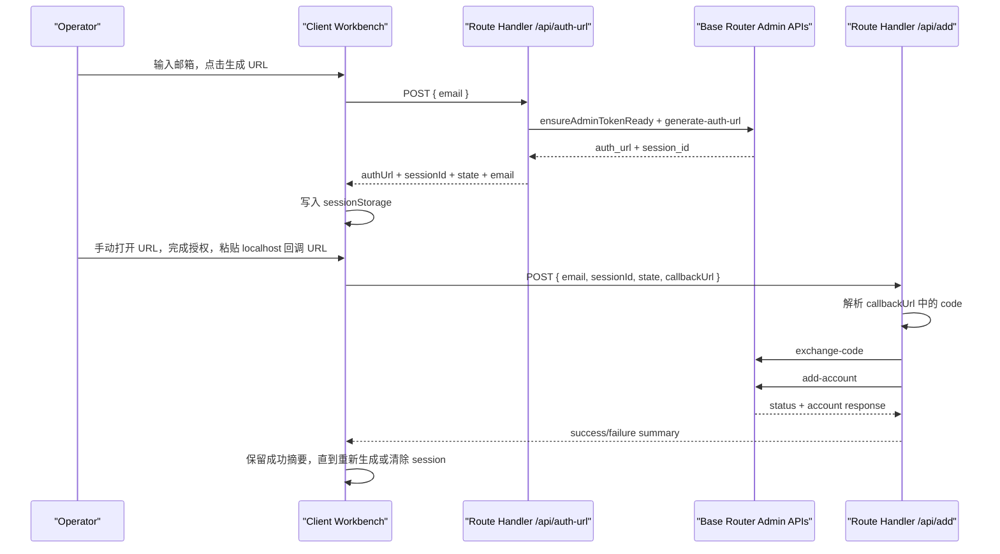

# feat: Build semiauto-add workbench

## Problem Frame

需要在绿地仓库 [`semiauto-add`](/D:/Code/Projects/semiauto-add) 中搭建一个单体 Next.js 内部操作台，替代 [`auto-add`](/D:/Code/Projects/auto-add) 当前 `Node.js + Playwright` 的浏览器自动化流程。新的系统只保留三类能力：

- 生成授权 URL
- 基于手工粘贴的 localhost 回调 URL 完成 `exchange_code -> add_account`

本计划以 [`2026-04-04-semiauto-add-requirements.md`](/D:/Code/Projects/semiauto-add/docs/brainstorms/2026-04-04-semiauto-add-requirements.md) 为唯一上游事实源，不再重新定义产品行为。

## Scope Boundaries

- 只做单页内部操作台，不做后台列表、批量任务、历史记录。
- 不保留任何 Playwright 运行时代码，也不引入新的浏览器自动化测试。
- 不做服务端 session；授权上下文保存在前端 session。
- 不改 `GEN_AUTH_URL` 的真实接口语义；邮箱仍然不作为它的后端入参。
- 不改变最终回调 URL 的规则；继续沿用 `http://localhost:1455...?...code=...` 的解析逻辑。

## Requirements Trace

- R1-R7e：由单页客户端工作台、按钮状态机、重生成重置逻辑和成功摘要承担。
- R8-R10a：由 `auto-add` 迁移出的 server-only HTTP 模块、回调解析模块、前端 session 管理承担。
- R11-R18：由 Next.js App Router 架构、Route Handlers、敏感信息只留服务端、日志脱敏、环境变量复用承担。

## Context & Research

### Local Research

- 当前 [`semiauto-add`](/D:/Code/Projects/semiauto-add) 除 `docs/` 外没有任何代码或配置文件，可按纯绿地项目规划。
- 没有 [`docs/solutions`](/D:/Code/Projects/semiauto-add/docs/solutions) 目录，也没有可复用的 institutional learnings。
- 可直接复用的旧模块集中在 [`auto-add/src/api`](/D:/Code/Projects/auto-add/src/api)、[`auto-add/src/auth`](/D:/Code/Projects/auto-add/src/auth)、[`auto-add/src/temp-email`](/D:/Code/Projects/auto-add/src/temp-email)、[`auto-add/src/shared`](/D:/Code/Projects/auto-add/src/shared)。
- 必须抛弃的旧模块集中在 [`auto-add/src/browser`](/D:/Code/Projects/auto-add/src/browser)、[`auto-add/src/flows`](/D:/Code/Projects/auto-add/src/flows)、[`auto-add/src/locators`](/D:/Code/Projects/auto-add/src/locators) 中所有依赖浏览器编排的代码。

### Existing Patterns To Follow

- 管理员 token 预检与自动刷新模式来自 [`auto-add/src/auth/admin-token.js`](/D:/Code/Projects/auto-add/src/auth/admin-token.js)。
- 生成授权 URL 模式来自 [`auto-add/src/api/auth-url.js`](/D:/Code/Projects/auto-add/src/api/auth-url.js)。
- `exchange_code` 与 `add_account` 请求模式来自 [`auto-add/src/api/exchange-code.js`](/D:/Code/Projects/auto-add/src/api/exchange-code.js) 和 [`auto-add/src/api/add-account.js`](/D:/Code/Projects/auto-add/src/api/add-account.js)。
- `add_account` payload 组装模式来自 [`auto-add/src/shared/account-payload.js`](/D:/Code/Projects/auto-add/src/shared/account-payload.js)。
- 回调 URL 解析模式来自 [`auto-add/src/shared/callback-url.js`](/D:/Code/Projects/auto-add/src/shared/callback-url.js)。
- 回调 URL 解析与账号添加能力继续复用 `auto-add` 中已验证的纯 HTTP 模块与共享逻辑。

### Existing Test Anchors

- `requestGenAuthUrl` 的 POST + Bearer 行为见 [`auto-add/index.test.js:1092`](/D:/Code/Projects/auto-add/index.test.js:1092)。
- `requestExchangeCode` 的 `{ code, session_id, state }` payload 行为见 [`auto-add/index.test.js:386`](/D:/Code/Projects/auto-add/index.test.js:386)。
- `requestAddAccount` 的 payload 与错误包装见 [`auto-add/index.test.js:490`](/D:/Code/Projects/auto-add/index.test.js:490)。
- - localhost callback 的 `code` 解析与 flow 组合见 [`auto-add/index.test.js:1654`](/D:/Code/Projects/auto-add/index.test.js:1654)。

### External References

- Next.js App Router Route Handlers official docs: [nextjs.org/docs/app/building-your-application/routing/route-handlers](https://nextjs.org/docs/app/building-your-application/routing/route-handlers)
- Next.js Server and Client Components official docs: [nextjs.org/docs/app/getting-started/server-and-client-components](https://nextjs.org/docs/app/getting-started/server-and-client-components)

### Planning Depth

本计划定为 **Standard**：

- 仓库是绿地，但改动跨了前端状态、服务端代理、敏感配置和旧模块迁移。
- 没有多服务部署或数据库迁移，因此没必要升到 Deep。

## Key Technical Decisions

### 1. 采用单体 Next.js App Router，而不是拆分前后端

- 页面和 API 都很薄，拆服务只会增加部署和状态同步成本。
- Route Handlers 足够承载两个内部 API：生成 URL、添加账号。
- 这直接落实 origin 里的 R11。

### 2. 复用 `auto-add` 的“纯 HTTP 能力”，不复用其总编排 flow

- 迁移对象是 API client、token 管理、回调解析和 payload 组装。
- 不迁移 `browser/`、`flows/`、`locators/`，也不保留兼容层。
- 理由：旧项目里真正稳定的是接口能力，不是 Playwright 页面流程。

### 3. 授权上下文保存在浏览器 `sessionStorage`

- 保存字段为 `email`、`authUrl`、`sessionId`、`state`、最近成功摘要。
- 页面提供显式“清除当前 session”操作。
- 不引入服务端 session，可以保持系统无状态，且满足 R10a。

### 4. `api/add` 只接收当前操作所需的最小上下文

- 客户端向服务端提交 `email`、`sessionId`、`state`、`callbackUrl`。
- 服务端自行解析 `code`，再调用 `exchange_code -> add_account`。
- 不把管理员 token 或第三方完整原始响应暴露给前端。

### 5. 管理员 token 逻辑沿用 `auto-add`，但适配为“请求时准备”

- CLI 项目的“启动前预检”在 Next.js 中改为“每次内部 API 请求前准备”。
- 具体做法是：Route Handler 进入 server-only helper，helper 负责 `ensureAdminTokenReady()`，再继续目标请求。
- 这样保留旧能力，又不依赖一个 CLI 入口。

### 6. 测试体系使用 Vitest + Testing Library，不引入 Playwright

- 这是个 UI + Route Handler 混合项目，`node:test` 对 React 组件不友好。
- 需求已经明确“彻底抛弃 Playwright 部分”，E2E 自动化不应在首版重新出现。
- 服务端模块、Route Handler、Client Component 都能用 Vitest 覆盖到足够清楚的行为。

### 7. 只复用仍然有业务意义的 `auto-add` 环境变量

- 保留：`BASE_ROUTER_HOST`、`BASE_ROUTER_ADMIN_EMAIL`、`BASE_ROUTER_ADMIN_PASSWORD`、`GEN_AUTH_URL`、`AUTH_URL`、`LOGIN_URL`、`EXCHANGE_CODE_URL`、`ADD_ACCOUNT_URL`、`ADMIN_TOKEN`、`LOCAL_PROXY`。
- 移除：`ACCOUNT_PASSWORD`、`BROWSER_PROFILE_DIR`，因为它们只服务旧的浏览器自动化流程。
- 这仍然满足 R18 的核心意图：共享后端接口语义和配置命名，不重新发明一套配置名。

## High-Level Technical Design

这张图用于说明整体走向，是评审用的方向性设计，不是实现代码。

## Implementation Units

### [x] Unit 1: 搭建 Next.js、TypeScript 与测试骨架

**Goal**

建立可承载单页客户端与 Route Handlers 的基础工程，不在这一步引入业务逻辑。

**Files**

- Create: [`package.json`](/D:/Code/Projects/semiauto-add/package.json)
- Create: [`tsconfig.json`](/D:/Code/Projects/semiauto-add/tsconfig.json)
- Create: [`next.config.ts`](/D:/Code/Projects/semiauto-add/next.config.ts)
- Create: [`app/layout.tsx`](/D:/Code/Projects/semiauto-add/app/layout.tsx)
- Create: [`app/page.tsx`](/D:/Code/Projects/semiauto-add/app/page.tsx)
- Create: [`app/globals.css`](/D:/Code/Projects/semiauto-add/app/globals.css)
- Create: [`.gitignore`](/D:/Code/Projects/semiauto-add/.gitignore)
- Create: [`.env.example`](/D:/Code/Projects/semiauto-add/.env.example)
- Create: [`vitest.config.ts`](/D:/Code/Projects/semiauto-add/vitest.config.ts)
- Create: [`vitest.setup.ts`](/D:/Code/Projects/semiauto-add/vitest.setup.ts)
- Create: [`tests/smoke/app-shell.test.tsx`](/D:/Code/Projects/semiauto-add/tests/smoke/app-shell.test.tsx)

**Approach**

- 用 TypeScript 建立 App Router 骨架。
- `app/page.tsx` 先只负责挂载客户端工作台组件，不塞业务状态。
- `.env.example` 直接复用 `auto-add` 的环境变量命名，并新增任何 Next.js 自身必需但不影响业务语义的注释。
- `.env.example` 只保留 semiauto-add 仍然使用的后端环境变量；显式删除浏览器自动化专用配置，避免留下伪依赖。
- 先把 Vitest + jsdom + Testing Library 打通，为后续单元/组件/Route Handler 测试提供基线。

**Test Scenarios**

- `tests/smoke/app-shell.test.tsx`
  - 页面根节点能渲染工作台占位内容。
  - 没有任何业务输入时，不出现成功态或错误态残留。
- 配置样例检查
  - `.env.example` 包含 `BASE_ROUTER_HOST`、`BASE_ROUTER_ADMIN_EMAIL`、`BASE_ROUTER_ADMIN_PASSWORD`、`GEN_AUTH_URL`、`AUTH_URL`、`LOGIN_URL`、`EXCHANGE_CODE_URL`、`ADD_ACCOUNT_URL`、`ADMIN_TOKEN`、`LOCAL_PROXY`。
  - `.env.example` 不再包含 `ACCOUNT_PASSWORD` 与 `BROWSER_PROFILE_DIR`。

**Dependencies / Sequence**

- 这是所有后续单位的前置条件。

### [x] Unit 2: 迁移 server-only 复用模块与共享纯函数

**Goal**

把 `auto-add` 中与 Playwright 无关的可复用能力迁到新项目，形成独立、可测试、只在服务端运行的模块层。

**Files**

- Create: [`lib/server/config.ts`](/D:/Code/Projects/semiauto-add/lib/server/config.ts)
- Create: [`lib/server/errors.ts`](/D:/Code/Projects/semiauto-add/lib/server/errors.ts)
- Create: [`lib/server/base-router/admin-token.ts`](/D:/Code/Projects/semiauto-add/lib/server/base-router/admin-token.ts)
- Create: [`lib/server/base-router/auth-url.ts`](/D:/Code/Projects/semiauto-add/lib/server/base-router/auth-url.ts)
- Create: [`lib/server/base-router/exchange-code.ts`](/D:/Code/Projects/semiauto-add/lib/server/base-router/exchange-code.ts)
- Create: [`lib/server/base-router/add-account.ts`](/D:/Code/Projects/semiauto-add/lib/server/base-router/add-account.ts)
- - - - Create: [`lib/shared/callback-url.ts`](/D:/Code/Projects/semiauto-add/lib/shared/callback-url.ts)
- Create: [`lib/shared/account-payload.ts`](/D:/Code/Projects/semiauto-add/lib/shared/account-payload.ts)
- Create: [`tests/unit/lib/server/config.test.ts`](/D:/Code/Projects/semiauto-add/tests/unit/lib/server/config.test.ts)
- Create: [`tests/unit/lib/server/base-router/admin-token.test.ts`](/D:/Code/Projects/semiauto-add/tests/unit/lib/server/base-router/admin-token.test.ts)
- Create: [`tests/unit/lib/server/base-router/auth-url.test.ts`](/D:/Code/Projects/semiauto-add/tests/unit/lib/server/base-router/auth-url.test.ts)
- Create: [`tests/unit/lib/server/base-router/exchange-code.test.ts`](/D:/Code/Projects/semiauto-add/tests/unit/lib/server/base-router/exchange-code.test.ts)
- Create: [`tests/unit/lib/server/base-router/add-account.test.ts`](/D:/Code/Projects/semiauto-add/tests/unit/lib/server/base-router/add-account.test.ts)
- - - Create: [`tests/unit/lib/shared/callback-url.test.ts`](/D:/Code/Projects/semiauto-add/tests/unit/lib/shared/callback-url.test.ts)
- Create: [`tests/unit/lib/shared/account-payload.test.ts`](/D:/Code/Projects/semiauto-add/tests/unit/lib/shared/account-payload.test.ts)

**Approach**

- 优先保留旧模块的职责边界，而不是把所有逻辑塞进 Route Handlers。
- `config.ts` 负责从 `process.env` 读配置，并输出适用于 server-only 模块的 runtime config。
- `admin-token.ts` 保留“校验 -> 401 时登录 -> 更新当前运行态 token”的旧模式。
- `auth-url.ts` 负责提取 `authUrl` 与 `sessionId`，并从 `authUrl` query 中提取 `state`。
- `callback-url.ts` 必须继续使用与旧项目同等语义的 `URL` 解析逻辑，且校验前缀为 `http://localhost:1455`。
- 
**Test Scenarios**

- `tests/unit/lib/server/config.test.ts`
  - 缺少任意必填环境变量时抛出明确错误。
  - 环境变量命名与 `auto-add` 一致。
- `tests/unit/lib/server/base-router/admin-token.test.ts`
  - `AUTH_URL` 返回 `200` 时保留原 token。
  - `AUTH_URL` 返回 `401` 时触发管理员登录并更新运行态 token。
  - 登录响应缺少 `access_token` 时抛出明确错误。
  - 日志脱敏不暴露 token。
- `tests/unit/lib/server/base-router/auth-url.test.ts`
  - `requestGenAuthUrl` 使用 POST + Bearer。
  - 能从唯一真实响应形态中提取 `authUrl`、`sessionId` 和 `state`。
  - `authUrl` 缺少 `state` 时抛出明确错误。
- `tests/unit/lib/server/base-router/exchange-code.test.ts`
  - 请求 payload 为 `{ code, session_id, state }`。
  - 超时和非 2xx 返回步骤化错误。
- `tests/unit/lib/server/base-router/add-account.test.ts`
  - 会发送组装后的 payload。
  - 非 2xx 和缺少 `status` 的响应会失败。
- `tests/unit/lib/shared/callback-url.test.ts`
  - 可从 `http://localhost:1455/...?...code=...` 提取 `code`。
  - 非 localhost 前缀或缺少 `code` 时失败。
- `tests/unit/lib/shared/account-payload.test.ts`
  - 使用当前邮箱填充 `name` 和 `extra.email`。
  - 固定字段与 `auto-add` 现有 payload 语义一致。

**Dependencies / Sequence**

- 依赖 Unit 1。
- Unit 3 和 Unit 4 都建立在这一层之上。

### [x] Unit 3: 实现内部 Route Handlers

**Goal**

把 server-only 模块封装为三个最小内部 API，约束前后端边界和错误返回形态。

**Files**

- Create: [`app/api/auth-url/route.ts`](/D:/Code/Projects/semiauto-add/app/api/auth-url/route.ts)
- Create: [`app/api/add/route.ts`](/D:/Code/Projects/semiauto-add/app/api/add/route.ts)
- Create: [`app/api/add/route.ts`](/D:/Code/Projects/semiauto-add/app/api/add/route.ts)
- Create: [`tests/integration/app/api/auth-url.route.test.ts`](/D:/Code/Projects/semiauto-add/tests/integration/app/api/auth-url.route.test.ts)
- Create: [`tests/integration/app/api/add.route.test.ts`](/D:/Code/Projects/semiauto-add/tests/integration/app/api/add.route.test.ts)
- Create: [`tests/integration/app/api/add.route.test.ts`](/D:/Code/Projects/semiauto-add/tests/integration/app/api/add.route.test.ts)

**Approach**

- `/api/auth-url`
  - 输入：`{ email }`
  - 行为：校验 email 非空，准备管理员 token，请求 `GEN_AUTH_URL`
  - 输出：`{ email, authUrl, sessionId, state }`
- `/api/add`
  - 输入：空对象或无 body
  - 行为：固定读取 `crystiano@penaldo.top`
  - 输出：`{ code, subject, from, mailId, createdAt }`
- `/api/add`
  - 输入：`{ email, sessionId, state, callbackUrl }`
  - 行为：校验上下文完整，解析 callback URL 中的 `code`，再执行 `exchange_code -> add_account`
  - 输出：`{ status, isActive, email }` 加最小成功摘要
- 三个路由都返回统一、可读、脱敏的错误结构，不把第三方原始响应整个透传给前端。

**Test Scenarios**

- `tests/integration/app/api/auth-url.route.test.ts`
  - 空邮箱返回 400。
  - 成功时返回 `email`、`authUrl`、`sessionId`、`state`。
  - 失败时错误信息不泄露 Bearer token。
- `tests/integration/app/api/add.route.test.ts`
  - 成功时返回验证码和邮件元信息。
  - temp-email 无验证码时返回明确失败。
  - 路由不会接收或暴露前端传来的邮箱。
- `tests/integration/app/api/add.route.test.ts`
  - 缺少 `sessionId`、`state`、`callbackUrl` 任一字段时返回 400。
  - callback URL 非 localhost 前缀时返回 400。
  - 成功时正确串起 `exchange_code -> add_account`。
  - 失败时只返回最小错误信息，不返回第三方完整原始 body。

**Dependencies / Sequence**

- 依赖 Unit 2。
- Unit 4 的客户端交互依赖这些路由合同稳定。

### [x] Unit 4: 实现单页客户端工作台与前端 session 管理

**Goal**

实现用户可实际操作的页面，完整覆盖按钮顺序、前端 session、清除能力、loading 状态、成功摘要和重生成重置逻辑。

**Files**

- Create: [`components/semi-auto-workbench.tsx`](/D:/Code/Projects/semiauto-add/components/semi-auto-workbench.tsx)
- Create: [`lib/client/auth-session.ts`](/D:/Code/Projects/semiauto-add/lib/client/auth-session.ts)
- Modify: [`app/page.tsx`](/D:/Code/Projects/semiauto-add/app/page.tsx)
- Modify: [`app/globals.css`](/D:/Code/Projects/semiauto-add/app/globals.css)
- Create: [`tests/unit/lib/client/auth-session.test.ts`](/D:/Code/Projects/semiauto-add/tests/unit/lib/client/auth-session.test.ts)
- Create: [`tests/unit/components/semi-auto-workbench.test.tsx`](/D:/Code/Projects/semiauto-add/tests/unit/components/semi-auto-workbench.test.tsx)

**Approach**

- `semi-auto-workbench.tsx` 使用 Client Component。
- `auth-session.ts` 封装 `sessionStorage` key 的读写、清除和序列化，避免把序列化细节散在组件里。
- 组件首次挂载时先尝试从 `sessionStorage` 恢复授权上下文与最近一次成功摘要；恢复失败时安全回退到初始态。
- 页面状态至少包含：
  - `email`
  - 授权上下文 `{ authUrl, sessionId, state, email }`
  - 最新 code 结果
  - 回调 URL 输入值
  - 三个动作各自的 loading/success/error
  - 最近一次添加成功摘要
- 交互规则必须完全贴合 requirements：
  - 生成 URL 成功前不显示 URL 区与重新生成按钮
  - 邮箱改变时清空旧上下文和旧结果
  - 点击重新生成时清空旧 code、旧回调 URL、旧状态、旧成功摘要
  - 点击“清除当前 session”时回到初始态
  - 添加成功后保留成功摘要，直到重新生成或清除 session
  - “清除当前 session”作为次级操作出现，不改变 requirements 规定的主控件从上到下顺序

**Test Scenarios**

- `tests/unit/lib/client/auth-session.test.ts`
  - 能写入、读取、清除授权上下文。
  - 不合法 JSON 或缺字段时安全回退为空状态。
- `tests/unit/components/semi-auto-workbench.test.tsx`
  - 初始态控件顺序正确，URL 展示区默认不可见。
  - 若 `sessionStorage` 已有有效上下文，首次渲染时恢复 URL 展示区与成功摘要。
  - 点击“生成 URL”成功后显示 URL 展示区与重新生成按钮。
  - 邮箱变更会重置旧上下文和旧结果。
  - 点击“粘贴回调 URL”只触发一次即时请求，并展示 code 与邮件元信息。
  - 点击“添加”前缺少上下文或回调 URL 时按钮被禁用或提示错误。
  - 添加成功后保留成功摘要。
  - 点击“清除当前 session”后恢复初始态。

**Dependencies / Sequence**

- 依赖 Unit 3 的 API 合同。

### [x] Unit 5: 收尾文档、跨层验证与回归保护

**Goal**

把配置说明、运行说明和关键跨层场景补齐，保证实现完成后能稳定交接。

**Files**

- Create: [`README.md`](/D:/Code/Projects/semiauto-add/README.md)
- Modify: [`.env.example`](/D:/Code/Projects/semiauto-add/.env.example)
- Create: [`tests/integration/semi-auto-flow.contract.test.ts`](/D:/Code/Projects/semiauto-add/tests/integration/semi-auto-flow.contract.test.ts)

**Approach**

- README 只说明这是什么、需要哪些环境变量、页面怎么操作、哪些行为是手工完成的。
- 把跨层 contract 场景固化成集成测试，避免后面改 UI 或路由时破坏关键行为。
- 文档明确：最终 callback URL 必须是 `http://localhost:1455` 前缀；历史验证码邮箱固定；系统不自动打开授权页。

**Test Scenarios**

- `tests/integration/semi-auto-flow.contract.test.ts`
  - “生成 URL -> 写 session -> 添加账号” 需要的字段在前后端边界上保持一致。
  - 旧 session 被重生成覆盖后，后续提交不会混用旧 `sessionId/state`。
  - 任何失败响应都不包含敏感 token、temp-email 密码或完整 callback code。

**Dependencies / Sequence**

- 依赖 Unit 3 和 Unit 4。
- 这是交付前的回归保护层。

## System-Wide Impact

- 入口面从 CLI 脚本变成了浏览器内的内部工具页面，但底层还是调用同一批 Base Router / temp-email 能力。
- 敏感配置不再靠命令行参数，而是集中在 Next.js 服务端环境变量与 server-only 模块里。
- 运行时状态从“进程内总编排状态”转成“客户端 sessionStorage + 每个 API 请求的最小 payload”。
- 测试策略从 `node:test + Playwright 相关 mock` 转成 `Vitest + Testing Library + Route Handler/纯函数测试`。

## Risks & Dependencies

### Risks

- `GEN_AUTH_URL` 的真实响应结构虽然确定只有一种，但在首次联调前还没实测确认；实现时应先固定一个权威解析路径，再通过联调验证。
- 如果管理员 token 刷新仍保留 `.env` 回写行为，部署到只读文件系统时可能失败；实现必须保证“写回失败”不会阻塞本次请求的内存 token 更新。
- 前端 sessionStorage 丢失后，用户必须重新生成 URL；这符合 scope，但要在 UI 中说清楚。
- 客户端提交 `sessionId/state` 代表这些字段是“用户会话上下文”而不是“服务端信任秘密”；Route Handler 仍需做基础输入校验。

### External Dependencies

- Base Router 管理接口可用，并维持现有环境变量语义。
- temp-email 管理接口可用，并继续支持 `x-admin-auth` 请求头。
- `crystiano@penaldo.top` 可持续作为固定历史验证码邮箱。

## Open Questions

### Resolved During Planning

- 授权上下文存前端 session，而不是服务端 session。
- 页面必须提供清除当前 session 的能力。
- 粘贴回调 URL 为即时单次读取，不做轮询。
- 最终回调 URL 继续沿用 `http://localhost:1455` + `code` 参数的旧规则。
- 新项目环境变量命名直接复用 `auto-add`。
- 不引入 Playwright，包括运行时和测试时。

### Deferred To Implementation

- 联调时确认 `GEN_AUTH_URL` 返回结构中的唯一 `session_id` 权威路径；若旧代码里的兼容提取只是保守写法，落地时应收紧到真实单一路径。

## Sources & References

- Origin requirements: [`2026-04-04-semiauto-add-requirements.md`](/D:/Code/Projects/semiauto-add/docs/brainstorms/2026-04-04-semiauto-add-requirements.md)
- Reuse source: [`auto-add/src/api/auth-url.js`](/D:/Code/Projects/auto-add/src/api/auth-url.js)
- Reuse source: [`auto-add/src/auth/admin-token.js`](/D:/Code/Projects/auto-add/src/auth/admin-token.js)
- Reuse source: [`auto-add/src/api/exchange-code.js`](/D:/Code/Projects/auto-add/src/api/exchange-code.js)
- Reuse source: [`auto-add/src/api/add-account.js`](/D:/Code/Projects/auto-add/src/api/add-account.js)
- Reuse source: [`auto-add/src/shared/account-payload.js`](/D:/Code/Projects/auto-add/src/shared/account-payload.js)
- Reuse source: [`auto-add/src/shared/callback-url.js`](/D:/Code/Projects/auto-add/src/shared/callback-url.js)
- Reuse source: [`auto-add/src/temp-email/fetch-code.js`](/D:/Code/Projects/auto-add/src/temp-email/fetch-code.js)
- Supporting design note: [`auto-add/docs/plans/2026-03-19-admin-token-preflight-design.md`](/D:/Code/Projects/auto-add/docs/plans/2026-03-19-admin-token-preflight-design.md)
- Supporting design note: [`auto-add/docs/plans/2026-03-19-exchange-and-add-account-design.md`](/D:/Code/Projects/auto-add/docs/plans/2026-03-19-exchange-and-add-account-design.md)
