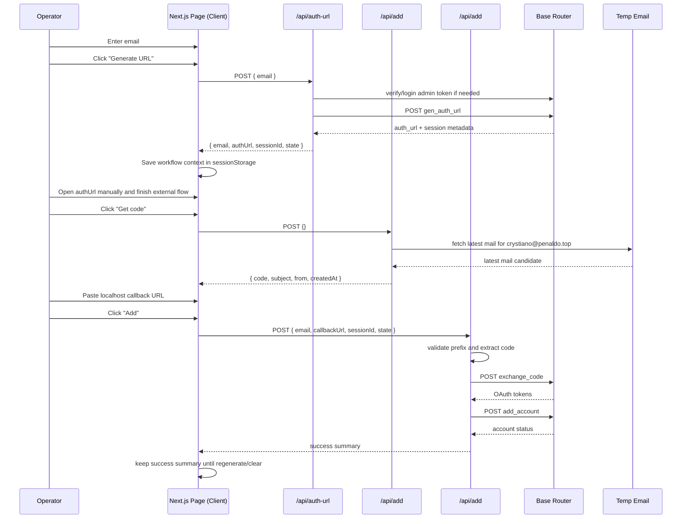

# feat: Build Semi-Auto Add Workflow

## Problem Frame
[`semiauto-add`](/D:/Code/Projects/semiauto-add) needs to replace [`auto-add`](/D:/Code/Projects/auto-add)'s browser automation with a single internal Next.js tool. The new tool must keep the proven server-side HTTP chain for `GEN_AUTH_URL`, temp-email lookup, `exchange_code`, and `add_account`, while moving all page interaction to the operator.

This plan implements the requirements in [the origin document](/D:/Code/Projects/semiauto-add/docs/brainstorms/2026-04-04-semiauto-add-requirements.md), especially:
- R1-R7e: single-page operator flow, loading states, reset behavior, fixed mail fetch, callback handling
- R8-R10a: server-side reuse of `auto-add` HTTP modules and client-side session storage
- R11-R18: single Next.js app, internal-tool boundary, env compatibility, redacted logging

## Scope Boundaries
- No Playwright, no browser drivers, no page locators, no localhost request listeners.
- No server-side workflow session store; the active workflow context lives in browser session storage.
- No batch mode, history screen, mailbox selector, or multi-page wizard.
- No guarantee that refresh survives; if browser session storage is gone, the operator regenerates the URL.

## Plan Depth
Standard.

Why:
- The repo is greenfield, but the feature crosses client UI, server routes, external admin APIs, and an email integration.
- Sensitive credentials stay server-side.
- The flow itself is small enough that a deep multi-phase architecture plan would be wasteful.

## Context & Research

### Origin Requirements
- Use the existing `GEN_AUTH_URL` behavior exactly as-is: it does not take email as an input (see origin: `/D:/Code/Projects/semiauto-add/docs/brainstorms/2026-04-04-semiauto-add-requirements.md`).
- Preserve the localhost callback parsing semantics from [`auto-add/src/shared/callback-url.js`](/D:/Code/Projects/auto-add/src/shared/callback-url.js).
- Keep the temp-email fetch fixed to `crystiano@penaldo.top`.
- Store workflow context on the client and expose a manual "clear session" control.

### Local Repo Grounding
- [`semiauto-add`](/D:/Code/Projects/semiauto-add) currently contains only the brainstorm doc. There is no existing app scaffold, no `docs/solutions/`, and no prior implementation pattern to follow locally.
- [`auto-add/package.json`](/D:/Code/Projects/auto-add/package.json) shows a small Node ESM codebase using `undici` plus a large Playwright layer that we should not migrate.
- Reusable integration seams already exist in:
  - [`auto-add/src/auth/admin-token.js`](/D:/Code/Projects/auto-add/src/auth/admin-token.js)
  - [`auto-add/src/api/auth-url.js`](/D:/Code/Projects/auto-add/src/api/auth-url.js)
  - [`auto-add/src/api/exchange-code.js`](/D:/Code/Projects/auto-add/src/api/exchange-code.js)
  - [`auto-add/src/api/add-account.js`](/D:/Code/Projects/auto-add/src/api/add-account.js)
  - [`auto-add/src/temp-email/service.js`](/D:/Code/Projects/auto-add/src/temp-email/service.js)
  - [`auto-add/src/add-parser.js`](/D:/Code/Projects/auto-add/src/add-parser.js)
  - [`auto-add/src/temp-email/fetch-code.js`](/D:/Code/Projects/auto-add/src/temp-email/fetch-code.js)
  - [`auto-add/src/shared/account-payload.js`](/D:/Code/Projects/auto-add/src/shared/account-payload.js)
  - [`auto-add/src/shared/callback-url.js`](/D:/Code/Projects/auto-add/src/shared/callback-url.js)
- The large regression anchor is [`auto-add/index.test.js`](/D:/Code/Projects/auto-add/index.test.js). The most useful scenarios to carry forward are:
  - env parsing and compatibility
  - admin token refresh behavior
  - request payload shape for `exchange_code` and `add_account`
  - callback URL parsing
  - temp-email candidate selection and code extraction

### Institutional Learnings
- None found. [`semiauto-add/docs/solutions`](/D:/Code/Projects/semiauto-add/docs/solutions) does not exist.

### External References
- [Next.js Route Handlers](https://nextjs.org/docs/app/building-your-application/routing/route-handlers)
- [Next.js Server and Client Components](https://nextjs.org/docs/app/getting-started/server-and-client-components)

These references support the split this plan uses: server-only integration code behind App Router route handlers, with the operator UI isolated in a client component.

## Requirements Trace
- R1, R7c, R7d, R10a, R13 -> Unit 4
- R2, R3, R8, R11, R12, R15, R17, R18 -> Units 1-3
- R4 -> Unit 4
- R5, R7e, R8, R12, R15 -> Units 2-4
- R6, R6a, R7, R8-R10 -> Units 2-4
- R7a, R7b, Success Criteria 4-5 -> Unit 4
- R14 -> Units 1 and 3
- Scope Boundaries -> All units, especially Units 1-2

## Key Technical Decisions

### 1. Build a single Next.js App Router application in TypeScript
Decision:
- Create a standard App Router project in this repo and keep both UI and API in one app.

Rationale:
- The project is greenfield and small.
- The sensitive logic already exists as HTTP helpers, not as a separate service boundary worth preserving.
- A separate API service would add deployment, typing, and state-handling overhead with no product gain.

### 2. Port only the HTTP and parsing primitives from `auto-add`
Decision:
- Migrate the reusable modules into `src/server/**` and `src/shared/**`, rewriting them into TypeScript but preserving behavior.
- Do not migrate any file from `auto-add/src/browser`, `auto-add/src/flows`, or `auto-add/src/locators`.

Rationale:
- The browser layer is exactly what this project is replacing.
- The HTTP modules and parsers already have clear seams and test coverage.

### 3. Keep workflow context in browser `sessionStorage`
Decision:
- Store the current generated auth context in browser session storage under one versioned key.
- The stored payload should contain only the operator-facing workflow data needed for the next step: `email`, `authUrl`, `sessionId`, `state`, generation timestamp, and a small status summary.

Rationale:
- The requirements explicitly choose client-side session storage.
- This tool is single-operator and internal, so client-side workflow state is sufficient.
- Avoids unnecessary server-side state and cleanup logic.

Consequences:
- Browser refresh may clear the flow or leave it inconsistent, which is acceptable per scope.
- The UI must expose explicit reset and clear-session controls.

### 4. Keep all sensitive integrations behind route handlers
Decision:
- The browser never calls Base Router or temp-email directly.
- The UI only talks to internal route handlers:
  - `POST /api/auth-url`
  - `POST /api/add`
  - `POST /api/add`

Rationale:
- Required by R12, R15, R17.
- Keeps admin token, admin password, temp-email auth header, and raw upstream responses out of the client bundle and network surface.

### 5. Preserve callback parsing semantics from `auto-add`
Decision:
- Port `FINAL_CALLBACK_URL_PREFIX = "http://localhost:1455"` and the `code` extraction helper into a shared utility.
- The add route validates the prefix and extracts `code` server-side.

Rationale:
- The requirements define this callback shape as authoritative.
- Reusing the same semantics is safer than creating a second parsing rule.

### 6. Reuse existing environment variable names, even when some become compatibility-only
Decision:
- The new env loader should preserve the current `auto-add` keys and meanings:
  - `BASE_ROUTER_HOST`
  - `BASE_ROUTER_ADMIN_EMAIL`
  - `BASE_ROUTER_ADMIN_PASSWORD`
  - `GEN_AUTH_URL`
  - `AUTH_URL`
  - `LOGIN_URL`
  - `EXCHANGE_CODE_URL`
  - `ADD_ACCOUNT_URL`
  - `ADMIN_TOKEN`
  - `TEMP_EMAIL_ADMIN_PWD`（已移除）
  - `ACCOUNT_PASSWORD`
  - `LOCAL_PROXY`
  - `BROWSER_PROFILE_DIR`
- `ACCOUNT_PASSWORD` and `BROWSER_PROFILE_DIR` can remain accepted but unused in the semi-auto flow.

Rationale:
- This satisfies R18 without forcing deployment or operator config churn.

### 7. Add lightweight in-app access control instead of assuming a private network
Decision:
- Protect the app and internal routes with Next middleware-based Basic Auth using two new env vars:
  - `INTERNAL_TOOL_USERNAME`
  - `INTERNAL_TOOL_PASSWORD`

Rationale:
- R14 says this cannot be treated as an anonymous public page.
- Middleware is the lowest-cost repo-contained protection for a single-operator internal tool.
- This adds two env vars, but does not redefine or rename any reused `auto-add` variable.

## High-Level Technical Design
This illustrates the intended approach and is directional guidance for review, not implementation specification.

## Implementation Units

### [ ] Unit 1: Bootstrap the Next.js app and runtime boundaries
Goal:
- Create the base application skeleton, shared env loader, and request/auth boundary for an internal-only tool.

Files:
- `/D:/Code/Projects/semiauto-add/package.json`
- `/D:/Code/Projects/semiauto-add/tsconfig.json`
- `/D:/Code/Projects/semiauto-add/next.config.ts`
- `/D:/Code/Projects/semiauto-add/app/layout.tsx`
- `/D:/Code/Projects/semiauto-add/app/globals.css`
- `/D:/Code/Projects/semiauto-add/middleware.ts`
- `/D:/Code/Projects/semiauto-add/.env.example`
- `/D:/Code/Projects/semiauto-add/src/server/config/env.ts`
- `/D:/Code/Projects/semiauto-add/src/server/lib/errors.ts`

Test files:
- `/D:/Code/Projects/semiauto-add/src/server/config/env.test.ts`
- `/D:/Code/Projects/semiauto-add/middleware.test.ts`

Approach:
- Initialize a TypeScript Next.js App Router project.
- Add a strict env loader modeled on [`auto-add/src/config/env.js`](/D:/Code/Projects/auto-add/src/config/env.js), preserving legacy key names and compatibility-only fields.
- Add middleware-based Basic Auth for page and API access.
- Add a shared step-error helper compatible with the `auto-add` integration modules.

Test scenarios:
- Env loader accepts all reused `auto-add` variable names and returns normalized values.
- Missing required Base Router or temp-email env vars fail with explicit messages.
- Compatibility-only keys (`ACCOUNT_PASSWORD`, `BROWSER_PROFILE_DIR`) are accepted without driving behavior.
- Middleware blocks anonymous requests and allows requests with correct Basic Auth credentials.
- Middleware protects `/api/*` as well as `/`.

Verification outcomes:
- The repo can host a Next.js app with a clear server/client split.
- Internal access control exists before any sensitive route is added.

Dependencies:
- None.

### [ ] Unit 2: Port the reusable server-only integration layer
Goal:
- Move the proven `auto-add` HTTP and parsing behavior into server-only TypeScript modules with no browser automation residue.

Files:
- `/D:/Code/Projects/semiauto-add/src/server/lib/base-router/admin-token.ts`
- `/D:/Code/Projects/semiauto-add/src/server/lib/base-router/auth-url.ts`
- `/D:/Code/Projects/semiauto-add/src/server/lib/base-router/exchange-code.ts`
- `/D:/Code/Projects/semiauto-add/src/server/lib/base-router/add-account.ts`
- `/D:/Code/Projects/semiauto-add/src/server/lib/temp-email/service.ts`
- `/D:/Code/Projects/semiauto-add/src/server/lib/add-parser.ts`
- `/D:/Code/Projects/semiauto-add/src/server/lib/temp-email/fetch-code.ts`
- `/D:/Code/Projects/semiauto-add/src/server/lib/accounts/payload.ts`
- `/D:/Code/Projects/semiauto-add/src/shared/callback-url.ts`

Test files:
- `/D:/Code/Projects/semiauto-add/src/server/lib/base-router/admin-token.test.ts`
- `/D:/Code/Projects/semiauto-add/src/server/lib/base-router/auth-url.test.ts`
- `/D:/Code/Projects/semiauto-add/src/server/lib/base-router/exchange-code.test.ts`
- `/D:/Code/Projects/semiauto-add/src/server/lib/base-router/add-account.test.ts`
- `/D:/Code/Projects/semiauto-add/src/server/lib/add-parser.test.ts`
- `/D:/Code/Projects/semiauto-add/src/server/lib/temp-email/fetch-code.test.ts`
- `/D:/Code/Projects/semiauto-add/src/server/lib/accounts/payload.test.ts`
- `/D:/Code/Projects/semiauto-add/src/shared/callback-url.test.ts`

Approach:
- Port the `auto-add` logic nearly verbatim where it is already cleanly separated from Playwright.
- Keep `requestGenAuthUrl`, `requestExchangeCode`, `requestAddAccount`, temp-email list/detail fetch, and code parsing behavior intact.
- Add a small `extractSessionId` helper alongside the auth URL helper. Start with the current defensive extraction semantics from `auto-add`, then document the single live response shape once integration confirms it.
- Port only `extractCodeFromCallbackUrl` and the localhost prefix constant from the old callback utility; exclude the Playwright request-listener helper.
- Preserve the current account payload builder and `ACCOUNT_GROUP_IDS` override behavior.

Test scenarios:
- `requestGenAuthUrl` sends a POST with Bearer auth and no fake email payload.
- `admin-token` refreshes on `401`, persists the new token, and leaves an already-valid token unchanged.
- `requestExchangeCode` sends `code`, `session_id`, and `state` exactly as expected.
- `requestAddAccount` serializes the payload and surfaces upstream failures clearly.
- Callback parsing accepts a localhost callback and rejects URLs missing `code`.
- Temp-email code parsing prefers the most recent OTP-like mail and ignores irrelevant newsletter mail.
- Temp-email fetch returns the fixed metadata shape the UI needs.
- Account payload builder preserves current model mapping and `ACCOUNT_GROUP_IDS` override behavior.

Verification outcomes:
- The repo now has a server-only library layer that reproduces the `auto-add` behavior we care about, without any Playwright dependency.

Dependencies:
- Unit 1.

### [ ] Unit 3: Expose minimal internal route handlers over the integration layer
Goal:
- Provide a stable internal API for the UI without exposing upstream secrets or raw responses.

Files:
- `/D:/Code/Projects/semiauto-add/app/api/auth-url/route.ts`
- `/D:/Code/Projects/semiauto-add/app/api/add/route.ts`
- `/D:/Code/Projects/semiauto-add/app/api/add/route.ts`
- `/D:/Code/Projects/semiauto-add/src/server/http/json.ts`
- `/D:/Code/Projects/semiauto-add/src/server/http/redact.ts`

Test files:
- `/D:/Code/Projects/semiauto-add/app/api/auth-url/route.test.ts`
- `/D:/Code/Projects/semiauto-add/app/api/add/route.test.ts`
- `/D:/Code/Projects/semiauto-add/app/api/add/route.test.ts`

Approach:
- Make all three route handlers `POST`-only and explicit `nodejs` runtime handlers.
- Return only minimal DTOs:
  - `/api/auth-url` -> `{ email, authUrl, sessionId, state }`
  - `/api/add` -> `{ address, code, subject, from, createdAt, mailId }`
  - `/api/add` -> `{ email, status, isActive, code }` or a similarly small success summary
- `/api/auth-url`:
  - accept `email` only as workflow context
  - ensure admin token readiness
  - call `requestGenAuthUrl`
  - extract `authUrl`, `sessionId`, and `state`
- `/api/add`:
  - accept no user-controlled address
  - always fetch from `crystiano@penaldo.top`
- `/api/add`:
  - accept `email`, `callbackUrl`, `sessionId`, and `state`
  - validate the callback prefix
  - extract `code`
  - call `exchange_code`
  - build the account payload
  - call `add_account`
- Add a redaction helper so route-level logs and client-visible errors never include tokens, passwords, or raw upstream response bodies.

Test scenarios:
- `/api/auth-url` returns the minimal workflow DTO and never forwards raw upstream JSON.
- `/api/auth-url` fails cleanly when `auth_url`, `session_id`, or `state` cannot be derived.
- `/api/add` ignores any client attempt to override the mailbox and always fetches the fixed address.
- `/api/add` returns a clean failure when no usable OTP mail exists.
- `/api/add` rejects missing workflow fields.
- `/api/add` rejects callback URLs that do not start with `http://localhost:1455`.
- `/api/add` rejects callback URLs that lack `code`.
- `/api/add` passes `code`, `session_id`, and `state` through to the exchange request and then builds the account payload from the exchange response.
- Error responses are redacted and do not leak secrets.

Verification outcomes:
- The operator UI gets a thin, purpose-built internal API.
- Sensitive credentials and upstream response details remain server-only.

Dependencies:
- Units 1-2.

### [ ] Unit 4: Build the operator page, session state, and UI state machine
Goal:
- Implement the single-page operator experience exactly as described in the requirements, with reset behavior that prevents mixed sessions.

Files:
- `/D:/Code/Projects/semiauto-add/app/page.tsx`
- `/D:/Code/Projects/semiauto-add/src/features/semiauto-add/types.ts`
- `/D:/Code/Projects/semiauto-add/src/features/semiauto-add/session-storage.ts`
- `/D:/Code/Projects/semiauto-add/src/features/semiauto-add/panel.tsx`
- `/D:/Code/Projects/semiauto-add/src/features/semiauto-add/request-state.ts`

Test files:
- `/D:/Code/Projects/semiauto-add/src/features/semiauto-add/session-storage.test.ts`
- `/D:/Code/Projects/semiauto-add/src/features/semiauto-add/panel.test.tsx`

Approach:
- Keep the page itself as a server component shell and render the operator workflow in a dedicated client component.
- Store the workflow context in `window.sessionStorage` under one versioned key, for example `semiauto-add.workflow.v1`.
- The client state machine should explicitly model:
  - initial state
  - auth URL loading/success/failure
  - code fetch loading/success/failure
  - add loading/success/failure
- Apply the required reset rules:
  - regenerate wipes the previous workflow context, code panel, callback input, and status messages
  - editing the email after a generated URL performs the same reset
  - clear session wipes the storage key and returns the page to its initial state
- The page should not automatically retry any action.
- After add success, keep the success summary visible until regenerate or clear.

Test scenarios:
- Initial render shows the controls in the required order and hides the generated URL block until generation succeeds.
- Successful auth URL generation stores `email`, `authUrl`, `sessionId`, and `state` in session storage and reveals the URL block.
- Clicking regenerate clears prior URL, code, callback input, and result state before showing the new workflow.
- Editing the email after URL generation performs the same reset and requires a new generation.
- Clicking clear session empties stored workflow data and returns the UI to its initial state.
- Each async action disables only its relevant control and shows loading text while pending.
- Code fetch shows the returned code and metadata.
- Add success shows the final summary and keeps it visible.
- Add failure shows an error without leaking raw upstream details.

Verification outcomes:
- The UI matches the origin workflow exactly.
- Session mixing is prevented by construction.

Dependencies:
- Units 1-3.

### [ ] Unit 5: Finalize operator-facing docs and manual smoke coverage
Goal:
- Leave the repo with enough documentation and manual verification guidance that the first real operator run is predictable.

Files:
- `/D:/Code/Projects/semiauto-add/README.md`
- `/D:/Code/Projects/semiauto-add/.env.example`

Test files:
- None beyond the existing automated coverage above.

Approach:
- Write a concise README covering:
  - what the tool does
  - required env vars
  - local run instructions
  - the exact operator workflow
  - what "clear session" and "regenerate" do
- Ensure `.env.example` includes both the reused `auto-add` vars and the new internal-auth vars.
- Add a manual smoke checklist for:
  - generate URL
  - fetch code
  - add account
  - invalid callback
  - expired/invalid admin token refresh

Verification outcomes:
- Another engineer can boot the tool and understand the intended operator workflow without reading implementation files.

Dependencies:
- Units 1-4.

## System-Wide Impact
- This introduces a new Next.js runtime into an otherwise empty repo.
- Existing operator config can carry over because the Base Router and temp-email env names remain unchanged.
- Internal access control adds two new env vars and a middleware layer that affects both page and API requests.
- Workflow state becomes browser-session-scoped rather than process-scoped, so the UI owns reset correctness.
- `GEN_AUTH_URL` response parsing still depends on the live upstream contract; the code should document the first confirmed live shape when implementation validates it.

## Risks & Dependencies
- **Upstream response contract risk**: the exact live `session_id` path has not been empirically reconfirmed yet. Mitigation: port the current defensive extractor first and verify the real shape during integration before tightening.
- **Token refresh side effect risk**: persisting a refreshed admin token back to `.env` is inherited behavior from `auto-add`. Mitigation: preserve it for compatibility, but isolate it in one module and test it directly.
- **Client-state drift risk**: session storage can hold stale workflow data if the UI does not reset aggressively. Mitigation: build reset semantics into the session helper and component tests.
- **Security boundary risk**: because there is no separate backend service, accidental client imports of server code would be costly. Mitigation: keep integration code under `src/server/**`, enforce route-handler-only access, and avoid exposing raw responses.
- **Dependency risk**: this plan assumes Base Router admin endpoints and the temp-email admin endpoint remain reachable from the Next.js runtime.

## Test Strategy
- Use one unit/integration test runner for the new repo; prefer a TypeScript-friendly setup that supports both Node-side route tests and client component tests.
- Keep coverage centered on:
  - env loading and middleware auth
  - admin token readiness
  - Base Router request serialization
  - temp-email parsing and candidate selection
  - callback URL parsing
  - route-handler DTO and redaction behavior
  - UI state transitions and reset rules
- Do not add Playwright or any browser automation tool for testing this feature.

## Documentation Notes
- The README should make it obvious that the email field is workflow context, not an input to `GEN_AUTH_URL`.
- The README should make it obvious that "Get code" always uses `crystiano@penaldo.top`.
- The README should make it obvious that the callback URL must be a `http://localhost:1455...` URL.

## Open Questions
- None blocking planning.

The only remaining unknown is implementation-time validation of the live `session_id` response shape from `GEN_AUTH_URL`. That does not change architecture, scope, or sequencing.
