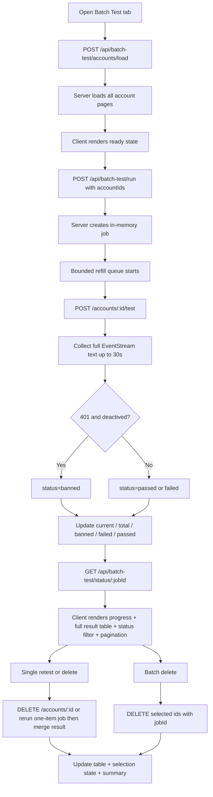

# feat: Add batch account testing tab

## Problem Frame

[`semiauto-add`](/D:/Code/Projects/semiauto-add) 目前已经完成 `添加账号` 单页流程，但 `批量测试` 页签仍是空白占位。当前需要把它扩展为一个内部运营工具页面，用来：

- 拉取全部账号列表
- 批量调用账号测试接口
- 根据完整 EventStream 判定账号状态
- 将本轮全部已测账号渲染到表格
- 支持按状态筛选
- 支持前端分页
- 支持单删和批量删
- 支持对单个账号手动重新测试
- 支持用户主动清理当前批量测试结果

本计划以 [`2026-04-04-semiauto-add-requirements.md`](/D:/Code/Projects/semiauto-add/docs/brainstorms/2026-04-04-semiauto-add-requirements.md) 中 `R19-R36` 为主，不重新定义产品行为。

## Scope Boundaries

- 不改动现有 `添加账号` 主流程，只在现有 tab 容器中扩展 `批量测试` 页签。
- 不引入数据库、任务队列、WebSocket 或定时任务。
- 不做测试模型配置、分页大小配置、导出 CSV、封禁原因细分。
- 不把 Base Router 原始 EventStream 全量透传给前端，只输出当前页面需要的最小结果。
- 不做数据库级持久化；当前服务生命周期内保留结果即可。
- 不做可配置并发数；首版把并发和超时定为服务端常量。

## Requirements Trace

- R19：由现有 tab 容器承载，`批量测试` 占位升级为真实页面。
- R20-R23：由新的 server-only 账号列表/测试服务与批量测试编排层承担。
- R24-R30：由前端批量测试页签、表格状态、状态筛选、分页、删除交互与确认机制承担。
- R31-R36：由超时策略、状态更新、结果保留和主动清理机制承担。

## Context & Research

### Local Research

- 当前项目已有可复用的服务端基础能力：
  - 配置读取 [`config.ts`](/D:/Code/Projects/semiauto-add/lib/server/config.ts)
  - token 准备 [`admin-token.ts`](/D:/Code/Projects/semiauto-add/lib/server/base-router/admin-token.ts)
  - 带代理回退的请求封装 [`fetch-with-proxy.ts`](/D:/Code/Projects/semiauto-add/lib/server/fetch-with-proxy.ts)
  - 已有 Base Router API client 模式 [`auth-url.ts`](/D:/Code/Projects/semiauto-add/lib/server/base-router/auth-url.ts), [`exchange-code.ts`](/D:/Code/Projects/semiauto-add/lib/server/base-router/exchange-code.ts), [`add-account.ts`](/D:/Code/Projects/semiauto-add/lib/server/base-router/add-account.ts)
- 当前前端已有 tab 容器与测试基线：
  - UI 主体 [`semi-auto-workbench.tsx`](/D:/Code/Projects/semiauto-add/components/semi-auto-workbench.tsx)
  - 组件测试 [`semi-auto-workbench.test.tsx`](/D:/Code/Projects/semiauto-add/tests/unit/components/semi-auto-workbench.test.tsx)
- 现有 `批量测试` 只是占位块，没有服务端或客户端状态逻辑。

### Existing Patterns To Follow

- Base Router HTTP client 应继续沿用 `config + ensureStep + fetchWithOptionalProxy + ProxyAgent` 这条模式，参考 [`auth-url.ts`](/D:/Code/Projects/semiauto-add/lib/server/base-router/auth-url.ts)。
- 动态 Route Handler 错误返回应继续沿用 [`app/api/add/route.ts`](/D:/Code/Projects/semiauto-add/app/api/add/route.ts) 的 `NextResponse.json({ error: { message } }, { status })` 模式。
- 前端 tab 与同页多状态交互应继续沿用 [`semi-auto-workbench.tsx`](/D:/Code/Projects/semiauto-add/components/semi-auto-workbench.tsx) 现有 state model，不新起第二个顶层页面。

### External Research

跳过。当前代码库已经有稳定的 Next.js App Router 与内部 API 模式，这次工作是同域增量扩展，外部文档不会比现有本地模式更关键。

### Planning Depth

本计划定为 **Standard**：

- 它跨了前端表格交互、服务端分页拉取、EventStream 解析、job 轮询、状态筛选、分页和删除操作。
- 但没有新的基础设施、没有数据库迁移、没有多服务编排。

## Key Technical Decisions

### 1. 复用现有单页 tab 容器，不新建独立路由

- 需求明确是页面顶部 tab 切换，不是新页面导航。
- 现有组件已经有 `activeTab` 状态，直接扩展最省改动。

### 2. 批量测试走“服务端 job 编排 + 前端轮询进度”，不把测试接口直接暴露给浏览器

- 账号测试接口返回 EventStream，且涉及管理员 token；这层必须留在服务端。
- 你已经明确要在测试过程中展示 `当前/总计` 进度，所以单次普通 POST 一把跑完不够用。
- 首版采用轻量内存 job + polling：
  - 前端创建批量测试 job
  - 服务端在后台跑受控并发队列
  - 前端轮询 `current/total`、`banned`、`failed`、`passed`

### 3. 账号列表拉取与测试执行拆成三层

- 第一层：Base Router 账号 API client
  - 列表
  - 单账号测试
  - 删除
- 第二层：批量测试 orchestration service
  - 拉完所有分页
  - 维护待测列表和运行中列表
  - 从全量列表中取一部分并发测试
  - 任一任务完成后立刻补位下一个
  - 汇总 `banned`、`failed`、`passed` 结果
- 第三层：job state store
  - 保存 `current/total`
  - 保存当前 job 的中间状态与最终结果
  - 保存全部已测账号的最新状态，供前端筛选、分页、重测和删除

### 4. EventStream 判定采用“完整文本缓冲后再判断”，并给单账号测试 30 秒超时

- 需求已经明确：必须等整条 stream 收完，且同时命中 `401` 与 `deactived` 才算封禁。
- 所以不做流式中途判定，不做 partial result 提前下结论。
- 单账号测试超时固定为 `30s`。
- 超时、流解析失败、请求失败都归入 `failed`，不会中断整批 job。
- 后续手动重测若成功，则以最新结果覆盖旧状态，即使该账号之前是 `已封禁`。

### 5. 批量测试使用固定并发补位队列，不在需求层暴露配置

- 需求只说“异步队列逻辑”，没有要求并发数可配。
- 计划建议把并发数作为服务端常量，例如 `3`。
- 队列规则是：每当一个账号测试完成，就从待测列表中再拉一个补上，直到全量列表跑完。

### 6. 删除操作必须绑定当前 `jobId`，成功依据只看接口 `200`

- 单删成功后从当前表格移除
- 批量删成功后批量移除
- 不在删除后自动重新拉取全部账号列表，避免多余请求和状态抖动
- 删除是否成功，以 `DELETE` 请求返回 `200` 为准
- 部分删除成功时，只移除成功项，失败项保留
- `delete route` 必须带上 `jobId`，这样服务端才能同步更新对应内存结果集，避免前端删掉后下一次 `status` 又把旧行带回来

### 7. 结果表格展示全部已测账号，不只展示封禁账号

- 批量测试完成后，表格展示的是本轮全部已测账号。
- 前端通过状态筛选来聚焦 `已封禁`、`测试成功`、`测试失败`。
- 前端分页作用于筛选后的结果集。
- 状态筛选变化时，页码要重置到第一页。

### 8. 单行重测必须 merge 回当前结果集

- 单行 `测试` 按钮复用同一批量测试 job 机制，只是输入变成单个 `accountId`。
- 重测完成后，必须把最新结果 merge 回当前结果集并重算统计，不允许形成脱离当前表格的孤立 job 结果。

### 9. 批量测试结果默认保留，由前端主动清理

- 你已经明确：为了支持后续筛选、分页与重测，后端不能在测试完成后主动清理当前结果。
- 页面提供显式“清除批量测试数据”按钮，由操作员手动清空当前结果和相关前端状态。

## High-Level Technical Design

这张图用于说明批量测试页签的整体走向，是评审用的方向性设计，不是实现代码。

## Implementation Units

### [ ] Unit 1: 新增账号列表、测试、删除的 Base Router API client

**Goal**

为批量测试补齐最小 server-only HTTP client，保持与现有 Base Router 模块一致的职责边界。

**Files**

- Create: [`lib/server/base-router/accounts.ts`](/D:/Code/Projects/semiauto-add/lib/server/base-router/accounts.ts)
- Create: [`tests/unit/lib/server/base-router/accounts.test.ts`](/D:/Code/Projects/semiauto-add/tests/unit/lib/server/base-router/accounts.test.ts)

**Approach**

- 提供三个函数：
  - `requestAccountsPage({ page, pageSize })`
  - `requestAccountTestStream({ accountId })`
  - `requestDeleteAccount({ accountId })`
- 三者都复用当前 `RuntimeConfig`、管理员 token 和代理回退策略。
- `requestAccountTestStream` 不在这一层做封禁判定，只返回完整 stream 文本或标准化片段。
- 列表 client 负责抽取分页所需字段：当前页数据、总数或总页数。

**Patterns To Follow**

- [`auth-url.ts`](/D:/Code/Projects/semiauto-add/lib/server/base-router/auth-url.ts)
- [`add-account.ts`](/D:/Code/Projects/semiauto-add/lib/server/base-router/add-account.ts)

**Test Scenarios**

- `requestAccountsPage`
  - 正确拼接 `page` 和 `page_size=100`
  - 正确发送 Bearer token
  - 非 2xx 时抛出步骤化错误
- `requestAccountTestStream`
  - 正确调用 `/accounts/<id>/test`
  - 固定发送 `{"model_id":"gpt-5.4","prompt":""}`
  - EventStream 读取有 `30s` 超时和 abort
  - 能把 EventStream 全文返回给上层
- `requestDeleteAccount`
  - 正确调用 `DELETE /accounts/<id>`
  - 非 2xx 时抛出明确错误

**Verification**

- 新增 unit test 通过
- 不需要改现有路由即可独立消费这些 client

### [ ] Unit 2: 实现批量测试编排服务

**Goal**

把“拉全分页 + 跑异步队列 + 解析状态结果”收敛到独立服务层，不把业务规则塞进 Route Handler。

**Files**

- Create: [`lib/server/batch-test/types.ts`](/D:/Code/Projects/semiauto-add/lib/server/batch-test/types.ts)
- Create: [`lib/server/batch-test/load-accounts.ts`](/D:/Code/Projects/semiauto-add/lib/server/batch-test/load-accounts.ts)
- Create: [`lib/server/batch-test/job-store.ts`](/D:/Code/Projects/semiauto-add/lib/server/batch-test/job-store.ts)
- Create: [`lib/server/batch-test/run-batch-test.ts`](/D:/Code/Projects/semiauto-add/lib/server/batch-test/run-batch-test.ts)
- Create: [`tests/unit/lib/server/batch-test/load-accounts.test.ts`](/D:/Code/Projects/semiauto-add/tests/unit/lib/server/batch-test/load-accounts.test.ts)
- Create: [`tests/unit/lib/server/batch-test/job-store.test.ts`](/D:/Code/Projects/semiauto-add/tests/unit/lib/server/batch-test/job-store.test.ts)
- Create: [`tests/unit/lib/server/batch-test/run-batch-test.test.ts`](/D:/Code/Projects/semiauto-add/tests/unit/lib/server/batch-test/run-batch-test.test.ts)

**Approach**

- `load-accounts.ts`
  - 先请求第一页
  - 根据总页数继续请求剩余页面
  - 输出最小列表结构：`[{ id, email }]`
- `job-store.ts`
  - 维护 job id、状态、当前数、总数、banned、failed、passed、完整结果列表
  - 生命周期只存在当前服务内存中
  - 提供显式清理入口，不在 job 完成后自动清空结果
- `run-batch-test.ts`
  - 输入 `accountIds`
  - 使用固定并发补位队列执行测试
  - 收集每个账号完整 stream 文本
  - 为每个账号设置 `30s` abort 超时
  - 只有全文同时命中 `401` 和 `deactived` 时返回为 `banned`
  - 同时汇总 `passed`、`failed`、`banned`
  - 每完成一个账号就更新 `current/total`
  - 把每个账号的最新测试状态写入完整结果列表
  - 同一账号二次手动重测成功时，会把旧的 `banned` 覆盖成 `passed`

**Patterns To Follow**

- 现有 `fetchTempEmailCodeJson` 的“先拉数据再格式化”的分层思路，参考 [`fetch-code.ts`](/D:/Code/Projects/semiauto-add/lib/server/temp-email/fetch-code.ts)

**Test Scenarios**

- `load-accounts`
  - 只有一页时只请求一次
  - 多页时会继续请求直到全部拉完
  - 最终只保留 `id`、`email`
- `run-batch-test`
  - 按固定并发补位，不会一次性把所有账号同时打出去
  - 单账号 30 秒超时后记入 `failed`，但整批继续
  - 完整流同时包含 `401` 与 `deactived` 时标记 `banned`
  - 只命中其中一个关键词时不标记 `banned`
  - 队列中单个账号失败不会中断整批流程，而是记录失败并继续
  - 输出结果包含 `current`、`total`、`banned`、`failed`、`passed`
  - 输出完整结果列表，每条记录都有最新状态
  - 手动重测成功后，会用最新状态覆盖旧状态

**Verification**

- 编排层 unit test 通过
- 上层调用时不需要关心 EventStream 解析细节

### [ ] Unit 3: 新增批量测试 Route Handlers

**Goal**

把批量测试所需的服务端能力暴露成前端可消费的最小内部 API。

**Files**

- Create: [`app/api/batch-test/accounts/route.ts`](/D:/Code/Projects/semiauto-add/app/api/batch-test/accounts/route.ts)
- Create: [`app/api/batch-test/run/route.ts`](/D:/Code/Projects/semiauto-add/app/api/batch-test/run/route.ts)
- Create: [`app/api/batch-test/status/[jobId]/route.ts`](/D:/Code/Projects/semiauto-add/app/api/batch-test/status/[jobId]/route.ts)
- Create: [`app/api/batch-test/delete/route.ts`](/D:/Code/Projects/semiauto-add/app/api/batch-test/delete/route.ts)
- Create: [`app/api/batch-test/clear/route.ts`](/D:/Code/Projects/semiauto-add/app/api/batch-test/clear/route.ts)
- Create: [`tests/integration/app/api/batch-test/accounts.route.test.ts`](/D:/Code/Projects/semiauto-add/tests/integration/app/api/batch-test/accounts.route.test.ts)
- Create: [`tests/integration/app/api/batch-test/run.route.test.ts`](/D:/Code/Projects/semiauto-add/tests/integration/app/api/batch-test/run.route.test.ts)
- Create: [`tests/integration/app/api/batch-test/status.route.test.ts`](/D:/Code/Projects/semiauto-add/tests/integration/app/api/batch-test/status.route.test.ts)
- Create: [`tests/integration/app/api/batch-test/delete.route.test.ts`](/D:/Code/Projects/semiauto-add/tests/integration/app/api/batch-test/delete.route.test.ts)
- Create: [`tests/integration/app/api/batch-test/clear.route.test.ts`](/D:/Code/Projects/semiauto-add/tests/integration/app/api/batch-test/clear.route.test.ts)

**Approach**

- `/api/batch-test/accounts`
  - 前端触发“加载账号列表”时调用
  - 服务端确保 token ready 后拉取全部分页
  - 返回最小账号列表和统计
- `/api/batch-test/run`
  - 输入收紧为 `accountIds: number[]`
  - 服务端创建 batch job 并异步启动
  - 立即返回 `jobId`
- `/api/batch-test/status/[jobId]`
  - 返回当前 job 的 `current/total`、`banned`、`failed`、`passed`、完成态
  - 返回完整结果列表，供前端筛选和分页
- `/api/batch-test/delete`
  - 输入 `{ jobId, accountIds: number[] }`
  - 服务端逐个删除
  - 返回成功删除的 id 列表和失败项
- `/api/batch-test/clear`
  - 输入 `jobId`
  - 服务端清空对应 job 的结果和派生状态

**Patterns To Follow**

- [`app/api/auth-url/route.ts`](/D:/Code/Projects/semiauto-add/app/api/auth-url/route.ts)
- [`app/api/add/route.ts`](/D:/Code/Projects/semiauto-add/app/api/add/route.ts)

**Test Scenarios**

- `accounts route`
  - 成功返回列表和总数
  - token 准备失败时返回 500 且信息脱敏
- `run route`
  - 输入空列表时返回 400
  - 成功时返回 `jobId`
  - 输入只接受 `accountIds`
  - 不透传原始 EventStream
- `status route`
  - job 不存在时返回 404
  - 成功返回 `current/total`、分类统计和完整结果列表
- `delete route`
  - 缺少 `jobId` 或输入空数组时返回 400
  - 成功返回 `deletedIds`
  - 部分失败时仍返回成功和失败拆分结果
  - 删除成功后会同步更新对应 job 的结果集
- `clear route`
  - 输入空 `jobId` 时返回 400
  - 成功后返回清理完成确认

**Verification**

- 所有 Route Handler integration test 通过
- 前端可只依赖内部 API，不直接碰 Base Router 管理端点

### [ ] Unit 4: 实现批量测试页签 UI、表格与删除交互

**Goal**

把现有 `批量测试` 占位页扩成可操作界面，并与新 API 合同连上。

**Files**

- Modify: [`components/semi-auto-workbench.tsx`](/D:/Code/Projects/semiauto-add/components/semi-auto-workbench.tsx)
- Modify: [`app/globals.css`](/D:/Code/Projects/semiauto-add/app/globals.css)
- Create: [`tests/unit/components/semi-auto-workbench.batch-test.test.tsx`](/D:/Code/Projects/semiauto-add/tests/unit/components/semi-auto-workbench.batch-test.test.tsx)

**Approach**

- 在 `activeTab === "batch-test"` 分支中加入：
  - 加载账号列表按钮
  - 开始批量测试按钮
  - 当前/总计 统计与进度区域
  - 失败数量反馈
  - 状态筛选控件
  - 前端分页控件
  - 全量结果表格
  - 行选择 checkbox
  - 批量删除按钮
  - 行级 `测试` 按钮
  - 清除批量测试数据按钮
- 客户端状态至少包括：
  - `accounts`
  - `isLoadingAccounts`
  - `isRunningBatchTest`
  - `isDeleting`
  - `allTestedAccounts`
  - `failedCount`
  - `passedCount`
  - `current`
  - `total`
  - `jobId`
  - `statusFilter`
  - `page`
  - `pageSize`
  - `selectedIds`
  - 每一步 feedback
- 删除前必须弹确认：
  - 单删：确认当前账号
  - 批量删：确认当前选中数量
- 开始批量测试按钮只有在账号列表已成功加载且 `accounts.length > 0` 时才可点击
- 单行 `测试` 按钮会对该行账号重新创建一个一项 job，复用相同判定规则
- 单行 `测试` 完成后必须把最新结果 merge 回当前结果集并重算统计
- 清除按钮会清空当前 job 结果、筛选状态和选择状态
- 前端分页只作用于当前结果集的展示层；状态筛选变化时应重置到第一页

**Patterns To Follow**

- 继续沿用当前 `SemiAutoWorkbench` 的单组件状态风格与反馈区模式

**Test Scenarios**

- 初始进入 `批量测试` 页签时显示空白待执行态
- 加载账号列表成功后展示数量
- 未加载账号前，开始批量测试按钮不可点
- 批量测试运行中展示 `current/total`
- 批量测试完成后展示完整结果表格，并支持按状态筛选
- 完整结果表格支持前端分页
- 状态筛选变化时页码重置到第一页
- 手动重测成功后，原 `banned` 行会更新为 `passed`
- 勾选表格行后批量删除按钮可用
- 单删和批量删都会先触发确认
- 删除成功后对应行从表格中移除，并同步从 `selectedIds` 中清掉
- 部分删除成功时，只移除 `deletedIds`，失败行保留并展示失败反馈
- 行级 `测试` 按钮可重新测试该账号
- 点击清除批量测试数据后，当前结果表格与筛选状态被清空
- 切回 `添加账号` 页签时不影响已有主流程状态

**Verification**

- 新增组件测试通过
- 现有 `添加账号` 相关测试不回归

### [ ] Unit 5: 收尾文档与跨层 contract 回归

**Goal**

把批量测试功能的使用方式、接口契约和高风险行为补进文档与回归测试。

**Files**

- Modify: [`README.md`](/D:/Code/Projects/semiauto-add/README.md)
- Modify: [`tests/integration/semi-auto-flow.contract.test.ts`](/D:/Code/Projects/semiauto-add/tests/integration/semi-auto-flow.contract.test.ts)
- Modify: [`tests/smoke/app-shell.test.tsx`](/D:/Code/Projects/semiauto-add/tests/smoke/app-shell.test.tsx)

**Approach**

- README 增加 `批量测试` 页签说明：
  - 先加载账号列表
  - 再跑批量测试
  - 观察 `当前/总计`
  - 按状态筛选结果
  - 使用分页查看结果
  - 最后可执行重测、删除或清理当前结果
- 扩充 contract test，覆盖：
  - 批量测试状态接口输出 `current/total`
  - 批量测试结果输出分类统计和完整结果列表
  - 删除结果会从当前结果集中移除

**Test Scenarios**

- smoke test 确认两个 tab 都存在
- contract test 确认批量测试相关最小边界不会回归

**Verification**

- README 与功能一致
- smoke / contract test 覆盖新的 tab 入口

## System-Wide Impact

- 页面结构从“单一工具流”变成“双 tab 工具流”，但仍在同一组件和同一路由下运行。
- 服务端从现有 3 个内部 API 扩展到批量测试相关 5 个 API。
- Base Router 管理能力新增三个消费面：账号列表、账号测试、账号删除。
- 前端状态复杂度上升，尤其是 job 轮询、全量结果表格、状态筛选、分页、批量删除与重测进度，需要更明确的状态边界。

## Risks & Dependencies

### Risks

- 账号列表接口的分页元数据结构当前还未在本地实测，计划里应把“第一页返回的总页数如何抽取”作为实现期优先验证点。
- EventStream 文本格式如果不是单纯文本而是 `data:` 分片，需要在服务端 test client 里先做拼接/清洗，否则关键词匹配会失真。
- 如果批量测试并发过高，可能触发服务端频控或造成测试接口不稳定。
- job 状态保存在服务内存中，开发服务重启后进度会丢失；这在当前 scope 内接受，但要在 UI 上处理“job 不存在”。
- 由于结果默认保留，如果前端不主动清理，单个 job 的结果集会长期占据当前服务内存。
- 批量删除是高影响动作，确认弹窗和部分失败处理必须明确。

### External Dependencies

- `GET /api/v1/admin/accounts?page=<n>&page_size=100`
- `POST /api/v1/admin/accounts/<id>/test`
- `DELETE /api/v1/admin/accounts/<id>`
- 这三条接口都继续依赖管理员 token 和当前 Base Router 权限模型。

## Open Questions

### Resolved During Planning

- `批量测试` 继续作为现有单页工具中的一个 tab，不新开路由。
- 测试请求体固定为 `{"model_id":"gpt-5.4","prompt":""}`。
- 封禁判定规则固定为：完整流同时命中 `401` 与 `deactived`。
- 删除支持单删和批量删，且都必须确认。
- 进度展示采用轻量 job + polling，不用 SSE。
- 单账号测试超时固定为 `30s`。
- 删除成功只以接口 `200` 为准。
- 测试完成后默认展示全部已测账号，并通过状态筛选收敛视图。
- 当前结果保留到用户主动清理为止。
- 删除 route 必须带 `jobId`，以保证服务端结果集和前端视图一致。
- 单行重测必须 merge 回当前结果集，而不是生成一个孤立结果。

### Deferred To Implementation

- 账号列表接口里总页数/总数的真实字段名，需要在实现时先用第一页响应验证。
- 测试接口 EventStream 的精确分段格式，需要在实现时先抓一次真实样本确认解析方式。

## Sources & References

- Origin requirements: [`2026-04-04-semiauto-add-requirements.md`](/D:/Code/Projects/semiauto-add/docs/brainstorms/2026-04-04-semiauto-add-requirements.md)
- Current UI shell: [`semi-auto-workbench.tsx`](/D:/Code/Projects/semiauto-add/components/semi-auto-workbench.tsx)
- Existing Base Router pattern: [`auth-url.ts`](/D:/Code/Projects/semiauto-add/lib/server/base-router/auth-url.ts)
- Existing Base Router pattern: [`add-account.ts`](/D:/Code/Projects/semiauto-add/lib/server/base-router/add-account.ts)
- Existing token flow: [`admin-token.ts`](/D:/Code/Projects/semiauto-add/lib/server/base-router/admin-token.ts)
