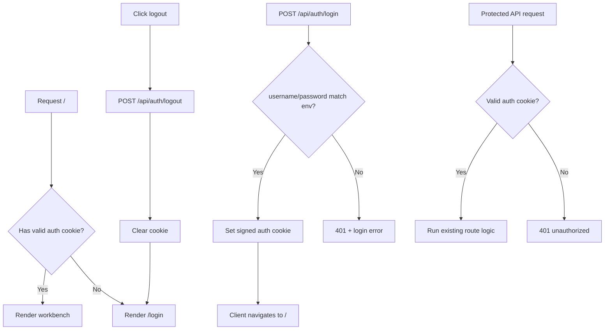

# feat: Add simple auth gate

## Problem Frame

[`semiauto-add`](/D:/Code/Projects/semiauto-add) 已经部署到 VPS 并可通过域名访问。当前任何拿到地址的人都能直接访问页面和内部 API，这对现有管理员能力来说风险过高。目标是增加一层最简共享用户名密码登录门，用最低复杂度阻止未授权访问，同时不把项目演变成完整用户系统。

## Scope Boundaries

- 不做数据库用户表。
- 不做注册、忘记密码、邮件找回、多角色或权限矩阵。
- 不做第三方登录。
- 不改变现有 `添加账号` 与 `批量测试` 的业务流程，只在它们前面加访问控制。

## Requirements Trace

- R1-R6：由登录页、cookie 登录态、退出按钮和受保护页面流承担。
- R7-R9：由服务端环境变量和 cookie 签名逻辑承担。
- R10-R12：由集中式保护层和 API 校验 helper 承担。
- R13-R17：由最简登录表单、401 处理和退出交互承担。

## Context & Research

### Relevant Code and Patterns

- 当前页面入口是 [`app/page.tsx`](/D:/Code/Projects/semiauto-add/app/page.tsx)，工作台主体在 [`components/semi-auto-workbench.tsx`](/D:/Code/Projects/semiauto-add/components/semi-auto-workbench.tsx)。
- 现有内部 API 都在 [`app/api`](/D:/Code/Projects/semiauto-add/app/api) 下，适合统一挂保护：
  - [`app/api/auth-url/route.ts`](/D:/Code/Projects/semiauto-add/app/api/auth-url/route.ts)
  - [`app/api/add/route.ts`](/D:/Code/Projects/semiauto-add/app/api/add/route.ts)
  - [`app/api/batch-test`](/D:/Code/Projects/semiauto-add/app/api/batch-test)
- 当前项目没有现成 auth、中间件或 cookie 工具封装，是绿地接入。

### Existing Patterns To Follow

- 动态 Route Handler 错误返回统一沿用 [`app/api/add/route.ts`](/D:/Code/Projects/semiauto-add/app/api/add/route.ts) 的 `NextResponse.json({ error: { message } }, { status })` 风格。
- 服务端配置读取统一走 [`lib/server/config.ts`](/D:/Code/Projects/semiauto-add/lib/server/config.ts)。
- 前端状态与反馈继续沿用 [`components/semi-auto-workbench.tsx`](/D:/Code/Projects/semiauto-add/components/semi-auto-workbench.tsx) 当前单组件状态风格。

### External Research

跳过。当前需求是最简共享凭据登录门，Next.js 原生 `cookies()`、middleware 和 Route Handlers 已足够，本地模式比额外外部研究更重要。

### Planning Depth

本计划定为 **Standard**：

- 它跨了页面访问控制、API 保护、cookie 签名和前端登录流。
- 但没有数据库、外部认证系统或复杂权限模型。

## Key Technical Decisions

### 1. 使用共享用户名密码 + 签名 cookie，不做用户系统

- 这是当前最小、最便宜、最符合目标的方案。
- 共享凭据来自服务端环境变量：`AUTH_USERNAME`、`AUTH_PASSWORD`、`AUTH_COOKIE_SECRET`。

### 2. 页面与内部 API 一起保护

- 只挡页面不挡 API 没意义。
- 计划采用“middleware 负责页面与路由入口，server helper 负责 API 二次校验”的双层保护。

### 3. 登录页保持最小化

- 只保留：用户名、密码、登录按钮、错误提示。
- 登录成功后跳回 `/`。
- 退出按钮放在现有工作台顶层区域即可，不额外新建设置页。

### 4. cookie 采用服务端签名，不把明文凭据或未签名状态放到前端

- cookie 里只保存最小登录态 payload，例如 `username + issuedAt` 的签名结果。
- 校验逻辑完全留在服务端 helper 中。

## High-Level Technical Design

> *This illustrates the intended approach and is directional guidance for review, not implementation specification. The implementing agent should treat it as context, not code to reproduce.*

## Implementation Units

### [x] Unit 1: 扩展环境配置与 cookie helper

**Goal:** 为最简登录门补齐共享凭据配置与 cookie 签名/校验工具。

**Requirements:** R7, R8, R9

**Dependencies:** None

**Files:**
- Modify: [`lib/server/config.ts`](/D:/Code/Projects/semiauto-add/lib/server/config.ts)
- Create: [`lib/server/auth/cookie.ts`](/D:/Code/Projects/semiauto-add/lib/server/auth/cookie.ts)
- Create: [`tests/unit/lib/server/auth/cookie.test.ts`](/D:/Code/Projects/semiauto-add/tests/unit/lib/server/auth/cookie.test.ts)
- Modify: [`.env.example`](/D:/Code/Projects/semiauto-add/.env.example)
- Modify: [`docker-compose.yml`](/D:/Code/Projects/semiauto-add/docker-compose.yml)

**Approach:**
- `config.ts` 新增读取：
  - `AUTH_USERNAME`
  - `AUTH_PASSWORD`
  - `AUTH_COOKIE_SECRET`
- `cookie.ts` 负责：
  - 生成签名 cookie 值
  - 校验 cookie
  - 提供统一 cookie 名常量
- `.env.example` 和 `docker-compose.yml` 同步新增这 3 个配置项。

**Patterns to follow:**
- [`lib/server/config.ts`](/D:/Code/Projects/semiauto-add/lib/server/config.ts)

**Test scenarios:**
- Happy path: 正确环境变量下能生成并验证一个合法 cookie
- Error path: 缺少任一 auth 环境变量时抛出明确错误
- Error path: 被篡改的 cookie 无法通过校验

**Verification:**
- cookie helper unit test 通过
- 配置样例与 compose 中都出现新的 auth 配置

### [x] Unit 2: 实现登录、退出与保护校验 helper

**Goal:** 补齐登录、退出和 Route Handler 侧的统一鉴权校验能力。

**Requirements:** R1, R3, R4, R6, R11, R12

**Dependencies:** Unit 1

**Files:**
- Create: [`lib/server/auth/guard.ts`](/D:/Code/Projects/semiauto-add/lib/server/auth/guard.ts)
- Create: [`app/api/auth/login/route.ts`](/D:/Code/Projects/semiauto-add/app/api/auth/login/route.ts)
- Create: [`app/api/auth/logout/route.ts`](/D:/Code/Projects/semiauto-add/app/api/auth/logout/route.ts)
- Create: [`tests/integration/app/api/auth/login.route.test.ts`](/D:/Code/Projects/semiauto-add/tests/integration/app/api/auth/login.route.test.ts)
- Create: [`tests/integration/app/api/auth/logout.route.test.ts`](/D:/Code/Projects/semiauto-add/tests/integration/app/api/auth/logout.route.test.ts)
- Create: [`tests/unit/lib/server/auth/guard.test.ts`](/D:/Code/Projects/semiauto-add/tests/unit/lib/server/auth/guard.test.ts)

**Approach:**
- `guard.ts` 提供：
  - `requireAuthenticatedRequest(requestLike)` 之类的统一校验入口
  - 未登录时抛标准 401 错误
- `login route`
  - 校验用户名密码
  - 成功后设置签名 cookie
  - 失败返回统一错误，不区分用户名或密码错误
- `logout route`
  - 清除 auth cookie

**Patterns to follow:**
- [`app/api/add/route.ts`](/D:/Code/Projects/semiauto-add/app/api/add/route.ts)

**Test scenarios:**
- Happy path: 正确用户名密码时设置 cookie 并返回成功
- Error path: 错误用户名或密码时返回 401 且错误文案统一
- Happy path: logout 会清掉 cookie
- Error path: guard 对无 cookie 或非法 cookie 返回未授权

**Verification:**
- auth routes 和 guard 的测试通过
- 登录失败提示不泄露究竟哪一项错了

### [x] Unit 3: 保护页面入口和内部 API

**Goal:** 确保未登录用户既打不开页面，也调不了内部 API。

**Requirements:** R2, R3, R5, R10, R11, R12, R17

**Dependencies:** Unit 2

**Files:**
- Create: [`middleware.ts`](/D:/Code/Projects/semiauto-add/middleware.ts)
- Modify: [`app/api/auth-url/route.ts`](/D:/Code/Projects/semiauto-add/app/api/auth-url/route.ts)
- Modify: [`app/api/add/route.ts`](/D:/Code/Projects/semiauto-add/app/api/add/route.ts)
- Modify: [`app/api/batch-test/accounts/route.ts`](/D:/Code/Projects/semiauto-add/app/api/batch-test/accounts/route.ts)
- Modify: [`app/api/batch-test/run/route.ts`](/D:/Code/Projects/semiauto-add/app/api/batch-test/run/route.ts)
- Modify: [`app/api/batch-test/status/[jobId]/route.ts`](/D:/Code/Projects/semiauto-add/app/api/batch-test/status/[jobId]/route.ts)
- Modify: [`app/api/batch-test/delete/route.ts`](/D:/Code/Projects/semiauto-add/app/api/batch-test/delete/route.ts)
- Modify: [`app/api/batch-test/clear/route.ts`](/D:/Code/Projects/semiauto-add/app/api/batch-test/clear/route.ts)
- Create: [`tests/integration/auth-protection.test.ts`](/D:/Code/Projects/semiauto-add/tests/integration/auth-protection.test.ts)

**Approach:**
- `middleware.ts`
  - 保护页面路由
  - 登录页和登录/退出 API 放行
- 每个内部 API route 统一调用 guard helper 做二次保护，避免 middleware 配置漏网
- 前端后续看到 401 时会自行回登录页，这部分在 Unit 4 处理。

**Patterns to follow:**
- 现有各个 route 的错误返回风格

**Test scenarios:**
- Integration: 未登录访问 `/` 会被导到 `/login`
- Integration: 已登录访问 `/` 能正常进入工作台
- Integration: 未登录调用任一内部 API 返回 401
- Integration: 已登录调用内部 API 不受影响

**Verification:**
- 页面和 API 的保护测试通过
- 现有业务 route 的主逻辑不需要为鉴权做重复实现

### [x] Unit 4: 实现登录页、退出按钮与前端 401 处理

**Goal:** 把最简登录门做成真实可用的前端体验。

**Requirements:** R1, R2, R5, R6, R13, R14, R15, R16, R17

**Dependencies:** Unit 3

**Files:**
- Create: [`app/login/page.tsx`](/D:/Code/Projects/semiauto-add/app/login/page.tsx)
- Create: [`components/login-form.tsx`](/D:/Code/Projects/semiauto-add/components/login-form.tsx)
- Modify: [`components/semi-auto-workbench.tsx`](/D:/Code/Projects/semiauto-add/components/semi-auto-workbench.tsx)
- Modify: [`app/globals.css`](/D:/Code/Projects/semiauto-add/app/globals.css)
- Create: [`tests/unit/components/login-form.test.tsx`](/D:/Code/Projects/semiauto-add/tests/unit/components/login-form.test.tsx)
- Modify: [`tests/unit/components/semi-auto-workbench.test.tsx`](/D:/Code/Projects/semiauto-add/tests/unit/components/semi-auto-workbench.test.tsx)
- Modify: [`tests/smoke/app-shell.test.tsx`](/D:/Code/Projects/semiauto-add/tests/smoke/app-shell.test.tsx)

**Approach:**
- `login-form.tsx`
  - 用户名输入
  - 密码输入
  - 登录按钮
  - 错误提示
  - loading / disabled 状态
- `semi-auto-workbench.tsx`
  - 顶部增加退出按钮
  - 统一处理 fetch 返回 401 时的跳转
- `app/login/page.tsx`
  - 最小登录页容器

**Patterns to follow:**
- [`components/semi-auto-workbench.tsx`](/D:/Code/Projects/semiauto-add/components/semi-auto-workbench.tsx)
- [`app/globals.css`](/D:/Code/Projects/semiauto-add/app/globals.css)

**Test scenarios:**
- Happy path: 正确凭据登录后跳到首页
- Error path: 错误凭据时显示统一错误提示
- UX: 登录中按钮禁用且显示 loading
- Happy path: 点击退出后回到登录页
- Error path: 工作台中任一请求收到 401 时回到登录页

**Verification:**
- 登录页和退出按钮测试通过
- 未登录访问站点时默认看到登录页

### [x] Unit 5: 文档与回归收尾

**Goal:** 补齐运行文档与最小回归保护。

**Requirements:** R8, R16

**Dependencies:** Unit 4

**Files:**
- Modify: [`README.md`](/D:/Code/Projects/semiauto-add/README.md)
- Modify: [`.env.example`](/D:/Code/Projects/semiauto-add/.env.example)
- Modify: [`docker-compose.yml`](/D:/Code/Projects/semiauto-add/docker-compose.yml)

**Approach:**
- README 增加：
  - 登录门说明
  - 新环境变量说明
  - 退出能力说明
- `.env.example` 和 compose 示例与 auth 配置保持一致

**Test scenarios:**
- Smoke: 登录页入口和工作台入口不冲突
- Config: 示例环境变量与实际配置读取保持一致

**Verification:**
- 文档与实现一致
- 新部署环境只要补齐 auth 配置即可启用登录门

## System-Wide Impact

- 页面入口从“直接进工作台”变成“先过登录门，再进工作台”。
- 所有内部 API 都新增统一的鉴权前置校验。
- 部署环境新增 3 个 auth 相关环境变量。

## Risks & Dependencies

### Risks

- 最简共享凭据方案不适合多用户审计场景，但对当前目标足够。
- 如果 cookie 保护只做在 middleware 而不做 API 二次校验，未来新增接口时容易漏保护。
- 如果 401 前端处理不统一，用户会看到部分接口失败但页面停留在旧状态。

### External Dependencies

- 无新增外部服务依赖。
- 仅依赖现有 VPS/域名部署环境可设置新的 auth 环境变量。

## Open Questions

### Resolved During Planning

- 使用共享用户名密码，不做用户系统。
- 使用 cookie 维持登录态。
- 页面和 API 一起保护。
- 登录成功后跳回 `/`。

### Deferred To Implementation

- cookie 的签名细节采用 Node 原生 `crypto` 还是极小封装 helper，只要不引入过重依赖即可。

## Sources & References

- Origin requirements: [`2026-04-05-simple-auth-gate-requirements.md`](/D:/Code/Projects/semiauto-add/docs/brainstorms/2026-04-05-simple-auth-gate-requirements.md)
- Current workbench: [`semi-auto-workbench.tsx`](/D:/Code/Projects/semiauto-add/components/semi-auto-workbench.tsx)
- Existing route style: [`app/api/add/route.ts`](/D:/Code/Projects/semiauto-add/app/api/add/route.ts)
- Existing config pattern: [`lib/server/config.ts`](/D:/Code/Projects/semiauto-add/lib/server/config.ts)
